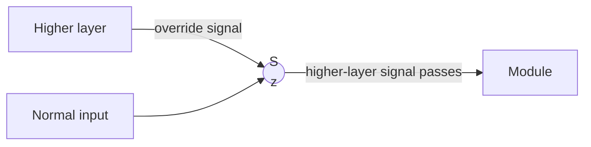
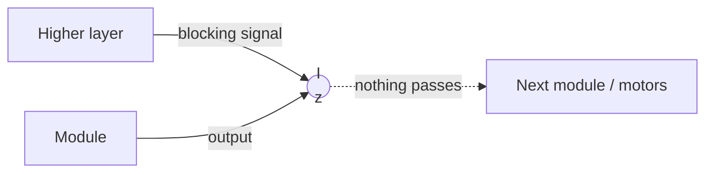

# THE QUESTION BANK — Artificial Life MA-INF 4201

**How to use this file.** Every question from the written papers is printed, and its answer follows directly below it. The variants after each answer change the numbers or the wording, because that is what the examiner changes. The section **IMPORTANT THEORY** holds slide material that the question does not ask for directly but that a new question could ask. Cover the answer, write it out on paper, and compare.

**There are two kinds of question.**

- 🔒 **MEMORIZE** questions have a fixed answer text and a fixed drawing, so you learn the answer block.
- ⚙️ **RECIPE** questions come with new numbers every year, so you learn the procedure and run it on the numbers given.

**These marking rules apply to every answer.**

- One point is worth roughly one clear sentence, one formula line, or one labelled sketch, so a 5-point question needs about five scoring items.
- The examiner wants exact values and the lecture's own words. The 2017 paper states that he *"wants explanations for all answers including formulas (which variable means what?)"*.
- You must define every symbol you write, because an undefined variable costs a mark.
- You should never leave a sub-part blank, because naming the mechanism earns points even when a calculation fails.

**Drawing convention.** Write this once at the top of your exam script: `.` means dead, white or 0, and `#` means alive, black or I.

---
---

# ASKED ON ALL FOUR PAPERS

These ten questions appeared on every written paper, and together they are worth roughly 55 of the 90 points.

---

## Q1 · Game of Life 🔒+⚙️
**This question appeared on 4 of 4 papers and was worth 10 points on three of them.**

**❓ 2023 `qn-02` 1 · 10 pt** — *"Explain the Game of Life, every detail of it. [pattern given] Draw the next 2 steps of this pattern and explain the rules of the GoL."*
**❓ 2023 `qn-03` · 10 pt** — *"Explain all parts of Conway's Game of Life with the example of a blinker."*
**❓ 2017 Q1 · 10 pt** — *"Explain all parts of Conway's Game of Life…"*

**✅ Answer**

**1. The CA specification.** Conway's Game of Life, proposed by John H. Conway in 1970, is a cellular automaton with the following properties:
- The grid is two-dimensional and rectangular, so $d = 2$.
- Each cell looks at a Moore neighbourhood of radius $r = 1$, which means the 8 surrounding cells.
- Each cell has $k = 2$ states: O (dead) and I (alive).
- The rule is legal, because it is symmetric and has a silent state.
- The rule models population dynamics: birth, survival, death from overcrowding and death from loneliness.

**2. The rule.** The lecture writes the rule as `23/3` (also written S23/B3).
- A dead cell is **born** if exactly 3 of its neighbours are alive.
- A living cell **survives** if 2 or 3 of its neighbours are alive.
- A living cell **dies from overcrowding** if more than 3 of its neighbours are alive.
- A living cell **dies from loneliness** if fewer than 2 of its neighbours are alive.

**3. The rule table.** The table is indexed by $S_a(t)$, the number of living cells among the 8 neighbours.

```
   S_a(t)              8   7   6   5   4   3   2   1   0
   ---------------------------------------------------------
   if a(t) is DEAD:    O   O   O   O   O   I   O   O   O
   if a(t) is ALIVE:   O   O   O   O   O   I   I   O   O
                       \_______________/   \___/   \____/
                          overcrowding    survive  loneliness
```

**4. The example: the blinker.** The blinker is an oscillator with period 2 and the archetype of class II behaviour.

```
      t=0            t=1            t=2  (= t=0)

   . . . . .      . . . . .      . . . . .
   . . . . .      . . # . .      . . . . .
   . # # # .      . . # . .      . # # # .
   . . . . .      . . # . .      . . . . .
   . . . . .      . . . . .      . . . . .
```

- The centre cell has 2 living neighbours, so it survives.
- The two end cells have 1 living neighbour each, so they die from loneliness.
- The dead cells directly above and below the centre have exactly 3 living neighbours, so they are born.
- Every other cell has at most 2 living neighbours and stays dead.

For 2023 `qn-02` 1 you evolve the printed pattern in the same way: for every cell, count its living neighbours and apply the four rules, then draw $t=1$ and $t=2$.

**5. The closing point.** Gosper's Glider Gun shows that unbounded growth is possible in the Game of Life. A stream of gliders carries information (one glider is one bit), and colliding gliders can be erased, delayed, reflected or doubled. This allows Boolean gates such as AND, OR and NOT to be built, so the Game of Life is computationally universal (Turing-complete).

---

**❓ 2023 `qn-02` 5 · 5 pt** — *"Draw a Game of Life pattern (Glider) that moves to the lower left corner. Draw 4 steps of this pattern."*

**✅ Answer**

```
     t=0              t=1              t=2              t=3              t=4

  . . . . . .      . . . . . .      . . . . . .      . . . . . .      . . . . . .
  . . . # . .      . . . . . .      . . . . . .      . . . . . .      . . . . . .
  . . # . . .      . . # . # .      . . # . . .      . . . # . .      . . # . . .
  . . # # # .      . . # # . .      . . # . # .      . # # . . .      . # . . . .
  . . . . . .      . . . # . .      . . # # . .      . . # # . .      . # # # . .
  . . . . . .      . . . . . .      . . . . . .      . . . . . .      . . . . . .
```

The glider consists of 5 living cells. After 4 steps it has the same shape again, shifted one cell to the left and one cell down.

---

**❓ 2025 T12 · 5 pt** — *"Within the Game of Life there is a pattern called glider. Give an example that moves to the lower-right and draw the 4 time-steps."* (Four 7×7 grids labelled t=0 to t=3 were printed.)

**✅ Answer**

```
     t=0              t=1              t=2              t=3              t=4

  . . . . . .      . . . . . .      . . . . . .      . . . . . .      . . . . . .
  . . # . . .      . . . . . .      . . . . . .      . . . . . .      . . . . . .
  . . . # . .      . # . # . .      . . . # . .      . . # . . .      . . . # . .
  . # # # . .      . . # # . .      . # . # . .      . . . # # .      . . . . # .
  . . . . . .      . . # . . .      . . # # . .      . . # # . .      . . # # # .
  . . . . . .      . . . . . .      . . . . . .      . . . . . .      . . . . . .
```

The glider consists of 5 living cells. After 4 steps it has the same shape again, shifted one cell to the right and one cell down. All five cells change their state on the way, so the shape recurs but the pattern is not periodic. The glider is the prototypic class IV pattern.

**How to draw a glider for any direction.**
1. Learn the lower-right glider above as your anchor.
2. For lower-left, mirror the anchor left–right. For upper-right, mirror it top–bottom. For upper-left, rotate it by 180°.
3. Evolve one step by hand and check that the cells moved in the asked direction.

### IMPORTANT THEORY

- The Game of Life rule has a silent state, is symmetric and is legal. It is not peripheral, because the centre cell matters, and it is not totalistic but **outer-totalistic**.
- The blinker is the archetype of class II behaviour (periodic), and the glider is the prototypic class IV pattern (complex).
- Gosper's Glider Gun emits one glider after another and was the first proof that a pattern in the Game of Life can grow without bound.
- Gliders can be used as bits, and their collisions build logic gates, which makes the Game of Life Turing-complete.

### VARIANTS

**V1.** *"Draw a glider that moves to the upper right. Give t=0 and t=1."*

<details><summary>Answer</summary>

The upper-right glider is the lower-right anchor mirrored top to bottom.

```
     t=0                    t=1

  . . . . . .            . . # . . .
  . # # # . .            . . # # . .
  . . . # . .            . # . # . .
  . . # . . .            . . . . . .
  . . . . . .            . . . . . .
  . . . . . .            . . . . . .
```

The living cells have moved up and to the right, so the direction is correct.
</details>

**V2.** *"Draw the next two steps of this pattern:"*

```
  . . . . .
  . # # . .
  . # # . .
  . . . . .
```

<details><summary>Answer</summary>

This pattern is the **block**, which is a still life. Each of the four living cells has exactly 3 living neighbours, so all four survive. Every dead cell around it has at most 2 living neighbours, so no cell is born. Therefore $t=1$ and $t=2$ are identical to $t=0$, and the block is a stable class II pattern.
</details>

**V3.** *"Explain the Game of Life using the toad as your example."*

<details><summary>Answer</summary>

You write parts 1, 2, 3 and 5 of the main answer and use the toad as the example. The toad is an oscillator with period 2.

```
      t=0                t=1                t=2 (= t=0)

   . . . . . .        . . . # . .        . . . . . .
   . . # # # .        . # . . # .        . . # # # .
   . # # # . .        . # . . # .        . # # # . .
   . . . . . .        . . # . . .        . . . . . .
   . . . . . .        . . . . . .        . . . . . .
```
</details>

**V4.** *"Is the Game of Life rule totalistic? Justify."*

<details><summary>Answer</summary>

No, the Game of Life rule is not totalistic; it is **outer-totalistic**. A totalistic rule depends only on the total of all 9 cells, including the centre. In the Game of Life a total of 4 can mean a living cell with 3 living neighbours, which survives, or a dead cell with 4 living neighbours, which stays dead. The same total therefore gives different results, so the rule depends separately on the centre state and on the sum of the 8 neighbours.
</details>

**⚠️ Traps.** You must not call the rule totalistic, because it is outer-totalistic. You must give the CA specification ($d$, $r$, $k$, legal) on the 10-point version. You must label every grid with its time step. You must check the glider direction by evolving one step.

---

## Q2 · Evolutionary Algorithm — full explanation + application 🔒
**This question appeared on 4 of 4 papers and is always worth 10 points.**

**❓ 2025 T2 · 10 pt** — *"Define all parts and steps of an Evolutionary Algorithm. What are the benefits and what are downsides? Use this to define an EA that solves the following scenario: [6 ingredients] … up to Y=15 additives out of possible Z=60. Every additive mustn't be more than 1%, all additives together mustn't be more than 3%. You may also use a council of students that rate the sodas; the best comparison is achieved when two sodas are compared."*
**❓ 2023 `qn-02` 3 · 10 pt** — *"Explain EAs, the idea behind them, the pros and cons. Develop steps for an Evolutionary algorithm for the following problem: You want to mix the perfect soda, there are 7 fixed ingredients and 70 possible additives. You can always use 15 additives at a time, the additives cannot be more than 3% of the total mix and each additive cannot be more than 1%. To evaluate the quality you have a pool of students willing to test the sodas, the best result is achieved if the students always compare 2 drinks to each other."*
**❓ 2023 `qn-03` · 10 pt** — *"Explain all parts of an EA with an example that had some genome restrictions."*

**✅ Answer**

**1. The idea.** An Evolutionary Algorithm is a stochastic, population-based optimization method inspired by biological evolution. It keeps a population of candidate solutions, evaluates each one with a fitness function, and repeatedly lets the better ones produce offspring by recombination and mutation, so the population improves over the generations.

**2. The parts.**

| Part | Explanation |
|---|---|
| Individual | An individual is one candidate solution. |
| Genome | The genome is the encoding of a solution, for example a bit string, a vector of real numbers or a tree. |
| Fitness function | The fitness function assigns a quality value to a genome, and it is the quantity being optimized. |
| Population | The population is the set of $\mu$ individuals that exists at one time. |
| Generation | A generation is one full pass through the EA cycle. |
| Operators | The operators are selection, recombination (inheritance) and mutation. |

**3. The EA cycle.**

```
        +-------------------- Initialization --------------------+
        |                                                        |
        v                                                        |
   Fitness evaluation                                            |
        |                                                        |
        v                                                        |
   External selection   (which individuals survive: (mu+lambda)   |
        |                or (mu,lambda), elitism, rank-based)     |
        v                                                        |
   Parent selection     (who reproduces: wheel of fortune,        |
        |                softmax, tournament)                     |
        v                                                        |
   Inheritance / Recombination  (crossover of parent genomes)     |
        |                                                        |
        v                                                        |
     Mutation           (random change of single genes)           |
        |                                                        |
        v                                                        |
     Finished?  --- no -------------------------------------------+
        |
       yes -> return best individual
```

1. **Initialization** creates the first population randomly or from prior knowledge.
2. **Fitness evaluation** computes the fitness of every individual.
3. **External selection** decides which individuals survive into the next generation.
4. **Parent selection** decides which survivors are allowed to reproduce.
5. **Inheritance / recombination** combines the genomes of two parents into offspring.
6. **Mutation** randomly changes single genes of the offspring.
7. **Termination** checks whether to stop; otherwise the cycle repeats from step 2.

**4. Benefits and downsides.**

| Benefits | Downsides |
|---|---|
| An EA needs no gradient and no model of the objective function. | An EA gives no guarantee of finding the global optimum. |
| An EA works on discrete, continuous and mixed genomes. | An EA needs many fitness evaluations, which is expensive when evaluation is costly. |
| An EA has anytime behaviour, so it has a usable answer whenever it is stopped. | An EA has many parameters to tune, such as population size, mutation rate and selection pressure. |
| An EA is easy to parallelize, because individuals are evaluated independently. | An EA can stagnate in a local optimum or be taken over by a super-individual. |
| An EA is robust against noisy or changing fitness. | The results are not reproducible unless the random seed is fixed. |

**5. The application: the soda problem.** The numbers below are for 2025 (6 base ingredients, 60 additives), and the 2023 numbers (7 base ingredients, 70 additives) are given in brackets.

**Step 0 — the numbers.** The problem has $B = 6$ ($B = 7$) base ingredients, $N = 60$ ($N = 70$) possible additives, at most $K = 15$ additives per soda, at most $A = 1\%$ per additive and at most $T = 3\%$ for all additives together. The students compare two sodas at a time, so the judge returns a pair winner.

**Step 1 — the genome.** The genome consists of $B$ real numbers for the base proportions and $K = 15$ slots. Each slot is a pair (index $\in \{1..N\}$, amount $\in [0, 1\%]$), and an amount of 0 means that the slot is unused, so "up to 15 additives" holds automatically. The genome length is $6 + 2\times15 = 6 + 30 = 36$ (for 2023: $7 + 30 = 37$). If exactly 15 additives are required, every amount must stay above a small minimum.

**Step 2 — the constraints.**
$$\begin{aligned}
K \times A &= 15 \times 1\% = 15\% \\
15\% &> 3\% \;\Rightarrow\; \text{the total cap is binding} \\
\text{additives at the maximum} &= 3 \div 1 = 3 \\
\text{average amount per slot} &= 3 \div 15 = 0.2\% \\
\text{base ingredients} &\ge 100 - 3 = 97\%
\end{aligned}$$

The total cap of 3 % is the binding constraint, because 15 additives at 1 % would give 15 %. The repair operator therefore works in this order:
1. If the sum of the amounts is above 3 %, every amount is multiplied by $3 / \text{sum}$.
2. Every amount is clipped to $[0, 1\%]$.
3. A duplicate index is replaced by a random unused index.
4. The base values are scaled so that they fill the remaining percentage.

A repair operator is better than a penalty here, because a student tasting is too expensive to waste on an infeasible soda. For example, if all 15 amounts are $0.3\%$:
$$\begin{aligned}
\textstyle\sum &= 15 \times 0.3 = 4.5\% > 3\% \;\Rightarrow\; \text{factor} = 3 \div 4.5 = 0.6667 \\
0.3 \times 0.6667 &= 0.2\% \text{ per additive} \\
\text{new } \textstyle\sum &= 15 \times 0.2 = 3.0\% \;\checkmark \\
\text{base } 50, 20, 10, 10, 5, 5: \textstyle\sum &= 100, \;\text{factor} = (100 - 3) \div 100 = 0.97 \\
50 \times 0.97 = 48.5, \; 20 \times 0.97 &= 19.4, \; 10 \times 0.97 = 9.7, \; 10 \times 0.97 = 9.7, \; 5 \times 0.97 = 4.85, \; 5 \times 0.97 = 4.85 \\
48.5 + 19.4 + 9.7 + 9.7 + 4.85 + 4.85 &= 97.0 \;\checkmark
\end{aligned}$$
(For 2023 the base 40, 20, 10, 10, 10, 5, 5 becomes $38.8 + 19.4 + 9.7 + 9.7 + 9.7 + 4.85 + 4.85 = 97.0$.)

**Step 3 — the selection.** Parent selection uses a **tournament of size 2**, because the students only compare two sodas at a time, so no absolute fitness value exists and fitness-proportional selection is not applicable.

**Step 4 — the operators.**
- Parent selection is a tournament of size 2.
- Recombination is one-point crossover on the base vector, and the additive slots are taken as a random subset from each parent, followed by the repair.
- Mutation adds a small Gaussian step to one amount, and with a low probability it swaps one additive index for an unused one.
- External selection is $(\mu+\lambda)$ with elitism, so the best soda is never lost.

**Step 5 — termination.** The EA stops when the tasting budget is used up, or when the best soda has not improved for several generations.

**Step 6 — why an EA.** The discrete part alone has
$$\binom{60}{15} = 53\,194\,089\,192\,720 \approx 5.3\times10^{13} \qquad \left(\binom{70}{15} = 721\,480\,692\,460\,864 \approx 7.2\times10^{14}\right)$$
combinations, before the continuous amounts are even considered. The fitness comes from human tasting, so there is no gradient and no model, and only a few hundred evaluations are affordable. This is exactly the situation EAs are made for.

---

**❓ 2017 Q3 · 10 pt** — *"Explain every aspect of EAs and how they contribute [+ exploration vs exploitation]"*

**✅ Answer**

You write parts 1 to 4 of the answer above (idea, parts, cycle with every step explained, benefits and downsides), and then add where exploration and exploitation happen:
- **Exploration** happens in the random initialization and in mutation, because both create genuinely new points in the search space.
- **Exploitation** happens in external selection, parent selection, elitism and the recombination of good parents, because they concentrate the search around solutions that are already good.
- The balance between the two controls the algorithm. Too much exploration turns the EA into random search, and too much exploitation makes the population collapse onto one point and stagnate.

### ⚙️ EA-DESIGN RECIPE — run these 6 steps on any recipe question

The process never changes, and only the numbers change. You fill in the blanks in order.

**Step 0 — Copy the numbers out of the question.**

| Symbol | Meaning |
|---|---|
| $B$ | $B$ is the number of base ingredients. |
| $N$ | $N$ is the number of possible extras (flavourings, oils, admixtures, and so on). |
| $K$ | $K$ is the maximum number of extras allowed in one recipe. |
| $A$ | $A$ is the maximum percentage of one extra. |
| $T$ | $T$ is the maximum percentage of all extras together. |
| $P$ | $P$ is the number of batches tested per round. |
| Judge | The judge returns either a full ranking, a pair winner, or a number. |

**Step 1 — Write the genome sentence.**
> "$B$ real numbers are the base proportions. $K$ slots follow, and each slot is a pair (index $\in\{1..N\}$, amount $\in[0,A\%]$). An amount of 0 means that the slot is unused, so 'up to $K$' holds automatically. The genome length is $B + 2K$."

**Step 2 — Do the constraint arithmetic.**
1. Compute $K \times A$.
2. If $K \times A > T$, write that the total cap is binding, and compute two numbers:
   - the number of extras that can sit at their maximum, which is $T \div A$ rounded down;
   - the average amount per slot, which is $T \div K$.
3. If $K \times A \le T$, write that the total cap can never be violated, and skip repair step 1 below.
4. The base ingredients receive $100 - \sum \text{amounts}$, which is at least $100 - T$.
5. Write the repair, always in this order:
   1. If the sum of the amounts is above $T$, every amount is multiplied by $T / \sum$.
   2. Every amount is clipped to $[0, A]$.
   3. A duplicate index is replaced by a new random unused index.
   4. Every base value is multiplied by $(100 - \sum\text{amounts}) / \sum\text{base}$.

**Step 3 — Choose the parent selection from the judge.**

| The judge returns | Write this | Formula |
|---|---|---|
| a full ranking of all $P$ batches | wheel of fortune on ranks | $\omega(r) = \dfrac{2(P-r+1)}{P(P+1)}$ |
| the winner of a pair | tournament of size 2 | The pair winner becomes the parent. |
| a number per batch | wheel of fortune, fitness-proportional | $\omega_i = f_i / \sum_j f_j$ |

**Step 4 — Write the operators, changing only the selection name.**
> "Parent selection is **[Step 3]**. Recombination is one-point crossover on the base vector, with a random subset of extra slots from each parent, followed by the repair. Mutation adds a small Gaussian step to one amount, and with a low probability it swaps an extra's index for an unused one. External selection is $(\mu+\lambda)$ with **elitism**, so the best recipe is never lost."

**Step 5 — Write the termination.**
> "The EA stops when the evaluation budget is used up (rounds $=$ budget $\div$ evaluations per round), or when the best batch has not improved for several rounds."

**Step 6 — Write why an EA is used.**
1. Compute $\binom{N}{K} = \dfrac{N (N-1) \cdots (N-K+1)}{K (K-1) \cdots 1}$.
2. Write: "The discrete part alone has $\binom{N}{K} = \_\_\_$ combinations, before the continuous amounts. The fitness comes from a panel or an experiment, so there is no gradient and no model. Every evaluation is expensive, so only a few evaluations are affordable."

### IMPORTANT THEORY

**There are two selection steps, and each one needs its own method.**

| | External selection | Parent selection |
|---|---|---|
| Question it answers | It decides how many individuals survive and which ones. | It decides which survivors reproduce. |
| Methods | $(\mu+\lambda)$, $(\mu,\lambda)$, elitism and deterministic rank-based truncation belong here. | The wheel of fortune, softmax and tournament belong here. |

- The wheel of fortune, softmax and tournament are only parent-selection methods, and $(\mu+\lambda)$ and elitism are only external-selection methods.
- The lecture's wheel of fortune is rank-proportionate, so "rank-based wheel of fortune" is one method and not two alternatives. The real choice is between fitness-proportional and rank-proportional shares.

**The fitness type decides the parent selection.**

| What the fitness gives | Method | Reason |
|---|---|---|
| Absolute numbers on a comparable scale | wheel of fortune, fitness-proportional | The sector size is proportional to the fitness, which is the simplest option. |
| Absolute numbers with one individual far ahead | wheel of fortune on ranks | Ranks ignore the size of the gap, so no super-individual takes over. |
| A need to control the selection pressure | softmax, $\omega_p = \dfrac{e^{f(p)/\tau}}{\sum_q e^{f(q)/\tau}}$ | A large $\tau$ makes the choice almost uniform, and a small $\tau$ makes it greedy. |
| A full ranking without numbers | wheel of fortune on ranks | Ranks are exactly what is available. |
| Only pairwise comparisons | tournament | A tournament is itself a pairwise comparison. |
| Noisy or very expensive fitness | tournament | A tournament only needs comparisons and is robust to noise. |

- For external selection the safe default is $(\mu+\lambda)$ with elitism, because the best solution is never lost and the performance graph never decreases. You switch to $(\mu,\lambda)$ only when the fitness changes over time or escaping local optima matters.
- The examiner marks the justification, so you always write the method together with a "because" clause.

### VARIANTS

**V1.** *"Design an EA to find the best chocolate recipe: 5 base ingredients, up to 10 flavourings from 40 possible, each flavouring ≤ 2 %, all flavourings ≤ 8 %. A panel ranks batches from best to worst."*

<details><summary>Answer</summary>

**Step 0.** The numbers are $B=5$, $N=40$, $K=10$, $A=2$ and $T=8$, and the judge returns a full ranking.

**Step 1.** The genome consists of 5 real numbers for the base proportions and 10 slots, each a pair (index $\in\{1..40\}$, amount $\in[0,2\%]$). An amount of 0 means that the slot is unused. The genome length is $5 + 2\times10 = 25$.

**Step 2.**
$$\begin{aligned}
K\times A &= 10 \times 2 = 20 \\
20 &> 8 \;\Rightarrow\; \text{the total cap is binding} \\
\text{at maximum} &= 8 \div 2 = 4 \\
\text{average} &= 8 \div 10 = 0.8\% \\
\text{base} &\ge 100 - 8 = 92\%
\end{aligned}$$
The repair first rescales all amounts by $8 / \text{sum}$ if the sum is above 8 %, then clips each amount to $[0, 2\%]$, then replaces duplicate indices, and finally scales the base to the remaining percentage.

**Step 3.** The panel returns a full ranking, so there is no absolute fitness value and parent selection uses the wheel of fortune on ranks with $\omega_i = \frac{2(P-r(i)+1)}{P(P+1)}$.

**Step 4.** The operators are the template sentence with "wheel of fortune on ranks" as the parent selection.

**Step 5.** The EA stops after a fixed number of tasting rounds or when the best batch stagnates.

**Step 6.** The discrete part alone has $\binom{40}{10} = 847\,660\,528 \approx 8.5\times10^8$ combinations. The fitness is human judgement, so there is no gradient and no model, and only a few hundred evaluations are affordable.
</details>

**D1.** *"Design an EA for the best soda: 4 base ingredients, up to 4 flavourings from 30 possible, each ≤ 1.5 %, all flavourings together ≤ 4 %. The panel always tastes two sodas and names the better one. Budget: 300 comparisons."*

<details><summary>Answer — recipe run</summary>

**Step 0.** The numbers are $B=4$, $N=30$, $K=4$, $A=1.5$ and $T=4$, and the judge returns a pair winner.

**Step 1.** The genome length is $4 + 2\times4 = 4 + 8 = 12$.

**Step 2.**
$$\begin{aligned}
K\times A &= 4 \times 1.5 = 6 \\
6 &> 4 \;\Rightarrow\; \text{the total cap is binding} \\
\text{at maximum} &= 4 \div 1.5 = 2.67 \;\Rightarrow\; 2 \\
\text{average} &= 4 \div 4 = 1\% \\
\text{base} &\ge 100 - 4 = 96\%
\end{aligned}$$

The repair works as follows for the amounts $1.5, 1.5, 1.0, 1.0$:
$$\begin{aligned}
\textbf{1. } \textstyle\sum &= 1.5 + 1.5 + 1.0 + 1.0 = 5.0 > 4 \;\Rightarrow\; \text{factor} = 4 \div 5.0 = 0.8 \\
1.5 \times 0.8 &= 1.2, \quad 1.5 \times 0.8 = 1.2, \quad 1.0 \times 0.8 = 0.8, \quad 1.0 \times 0.8 = 0.8 \\
\text{new } \textstyle\sum &= 1.2 + 1.2 + 0.8 + 0.8 = 4.0 \;\checkmark \\
\textbf{2. } &\text{all} \le 1.5 \;\checkmark \qquad \textbf{3. } \text{no duplicates} \\
\textbf{4. } \text{base } 60, 20, 10, 10: \textstyle\sum &= 100, \;\text{factor} = (100 - 4) \div 100 = 0.96 \\
60 \times 0.96 &= 57.6, \quad 20 \times 0.96 = 19.2, \quad 10 \times 0.96 = 9.6, \quad 10 \times 0.96 = 9.6 \\
57.6 + 19.2 + 9.6 + 9.6 &= 96 \;\checkmark
\end{aligned}$$

**Step 3.** The judge returns a pair winner, so parent selection is a tournament of size 2, because the panel only compares two sodas and no absolute fitness exists.

**Step 4.** The operators are the template sentence with "tournament of size 2" as the parent selection.

**Step 5.** One tournament costs 1 comparison and produces 1 parent. $\lambda = 10$ offspring need $2 \times 10 = 20$ parents, so one generation costs 20 comparisons.
$$300 \div 20 = 15 \text{ generations}$$
The budget allows 15 generations.

**Step 6.**
$$\begin{aligned}
30 \times 29 &= 870 \\
870 \times 28 &= 24\,360 \\
24\,360 \times 27 &= 657\,720 \\
4 \times 3 \times 2 \times 1 &= 24 \\
\tbinom{30}{4} = 657\,720 \div 24 &= 27\,405
\end{aligned}$$
The discrete part alone has 27 405 combinations.
</details>

**D2.** *"Design an EA for the best perfume: 3 base ingredients, up to 6 essential oils from 50 possible, each ≤ 3 %, all oils together ≤ 12 %. Each round the panel smells 6 perfumes and ranks them from best to worst. Budget: 20 rounds."*

<details><summary>Answer — recipe run</summary>

**Step 0.** The numbers are $B=3$, $N=50$, $K=6$, $A=3$, $T=12$ and $P=6$, and the judge returns a full ranking.

**Step 1.** The genome length is $3 + 2\times6 = 3 + 12 = 15$.

**Step 2.**
$$\begin{aligned}
K\times A &= 6 \times 3 = 18 \\
18 &> 12 \;\Rightarrow\; \text{the total cap is binding} \\
\text{at maximum} &= 12 \div 3 = 4 \\
\text{average} &= 12 \div 6 = 2\% \\
\text{base} &\ge 100 - 12 = 88\%
\end{aligned}$$

The repair works as follows for the amounts $3, 3, 3, 2, 2, 1$:
$$\begin{aligned}
\textbf{1. } \textstyle\sum &= 3 + 3 + 3 + 2 + 2 + 1 = 14 > 12 \;\Rightarrow\; \text{factor} = 12 \div 14 = 0.8571 \\
3 \times 0.8571 &= 2.5714 \;(\text{three times}) \\
2 \times 0.8571 &= 1.7143 \;(\text{twice}) \\
1 \times 0.8571 &= 0.8571 \\
\text{new } \textstyle\sum &= 2.5714 \times 3 + 1.7143 \times 2 + 0.8571 = 7.7143 + 3.4286 + 0.8571 = 12.0000 \;\checkmark \\
\textbf{2. } &\text{all} \le 3 \;\checkmark \qquad \textbf{3. } \text{no duplicates} \\
\textbf{4. } \text{base } 80, 15, 5: \textstyle\sum &= 100, \;\text{factor} = (100 - 12) \div 100 = 0.88 \\
80 \times 0.88 &= 70.4, \quad 15 \times 0.88 = 13.2, \quad 5 \times 0.88 = 4.4 \\
70.4 + 13.2 + 4.4 &= 88 \;\checkmark
\end{aligned}$$

**Step 3.** The judge returns a full ranking, so parent selection is the wheel of fortune on ranks, because the panel gives an order and no absolute numbers.
$$\begin{aligned}
P(P+1) &= 6 \times 7 = 42 \\
\omega(1) &= 2(6-1+1) \div 42 = 2 \times 6 \div 42 = 12/42 = 0.286 \\
\omega(2) &= 2(6-2+1) \div 42 = 2 \times 5 \div 42 = 10/42 = 0.238 \\
\omega(3) &= 2 \times 4 \div 42 = 8/42 = 0.190 \\
\omega(4) &= 2 \times 3 \div 42 = 6/42 = 0.143 \\
\omega(5) &= 2 \times 2 \div 42 = 4/42 = 0.095 \\
\omega(6) &= 2 \times 1 \div 42 = 2/42 = 0.048 \\
\text{check: } 12+10+8+6+4+2 &= 42 \Rightarrow 42/42 = 1 \;\checkmark
\end{aligned}$$

**Step 4.** The operators are the template sentence with "wheel of fortune on ranks" as the parent selection.

**Step 5.** The budget allows $20 \text{ rounds} \times 6 \text{ perfumes} = 120$ evaluations.

**Step 6.**
$$\begin{aligned}
50 \times 49 &= 2\,450 \\
2\,450 \times 48 &= 117\,600 \\
117\,600 \times 47 &= 5\,527\,200 \\
5\,527\,200 \times 46 &= 254\,251\,200 \\
254\,251\,200 \times 45 &= 11\,441\,304\,000 \\
6 \times 5 \times 4 \times 3 \times 2 \times 1 &= 720 \\
\tbinom{50}{6} = 11\,441\,304\,000 \div 720 &= 15\,890\,700
\end{aligned}$$
The discrete part alone has 15 890 700 combinations.
</details>

**D3.** *"Design an EA for the strongest concrete: 4 base ingredients, up to 3 admixtures from 25 possible, each ≤ 2 %, all admixtures together ≤ 5 %. A lab machine measures the compressive strength (MPa) of each of 5 samples per round."*

<details><summary>Answer — recipe run</summary>

**Step 0.** The numbers are $B=4$, $N=25$, $K=3$, $A=2$, $T=5$ and $P=5$, and the judge returns a number.

**Step 1.** The genome length is $4 + 2\times3 = 4 + 6 = 10$.

**Step 2.**
$$\begin{aligned}
K\times A &= 3 \times 2 = 6 \\
6 &> 5 \;\Rightarrow\; \text{the total cap is binding} \\
\text{at maximum} &= 5 \div 2 = 2.5 \;\Rightarrow\; 2 \\
\text{average} &= 5 \div 3 = 1.667\% \\
\text{base} &\ge 100 - 5 = 95\%
\end{aligned}$$

The repair works as follows for the amounts $2, 2, 1.5$:
$$\begin{aligned}
\textbf{1. } \textstyle\sum &= 2 + 2 + 1.5 = 5.5 > 5 \;\Rightarrow\; \text{factor} = 5 \div 5.5 = 0.9091 \\
2 \times 0.9091 &= 1.8182, \quad 2 \times 0.9091 = 1.8182, \quad 1.5 \times 0.9091 = 1.3636 \\
\text{new } \textstyle\sum &= 1.8182 + 1.8182 + 1.3636 = 5.0000 \;\checkmark \\
\textbf{2. } &\text{all} \le 2 \;\checkmark \qquad \textbf{3. } \text{no duplicates} \\
\textbf{4. } \text{base } 15, 8, 30, 47: \textstyle\sum &= 100, \;\text{factor} = (100 - 5) \div 100 = 0.95 \\
15 \times 0.95 &= 14.25, \quad 8 \times 0.95 = 7.6, \quad 30 \times 0.95 = 28.5, \quad 47 \times 0.95 = 44.65 \\
14.25 + 7.6 + 28.5 + 44.65 &= 95.00 \;\checkmark
\end{aligned}$$

**Step 3.** The judge returns a number, so parent selection is the fitness-proportional wheel of fortune, because the machine gives an absolute, positive and comparable value. For the strengths $30, 25, 20, 15, 10$ MPa the shares are:
$$\begin{aligned}
\textstyle\sum f &= 30 + 25 + 20 + 15 + 10 = 100 \\
\omega &= 30/100,\; 25/100,\; 20/100,\; 15/100,\; 10/100 = 0.30,\; 0.25,\; 0.20,\; 0.15,\; 0.10 \\
\text{check: } 0.30+0.25+0.20+0.15+0.10 &= 1 \;\checkmark
\end{aligned}$$
If one sample is far stronger than all others, you switch to the wheel of fortune on ranks to avoid a super-individual.

**Step 4.** The operators are the template sentence with "fitness-proportional wheel of fortune" as the parent selection.

**Step 5.** The EA stops after a fixed number of test rounds, because each strength test needs 28 days of curing, or when the best strength stagnates.

**Step 6.**
$$\begin{aligned}
25 \times 24 &= 600 \\
600 \times 23 &= 13\,800 \\
3 \times 2 \times 1 &= 6 \\
\tbinom{25}{3} = 13\,800 \div 6 &= 2\,300
\end{aligned}$$
The 2 300 combinations are multiplied by continuous amounts, so the search space is still infinite and every test is a slow experiment.
</details>

**D4.** *"Design an EA for the best spice blend: 5 base spices, up to 4 extras from 20 possible, each ≤ 1 %, all extras together ≤ 5 %. Each round the panel tastes 8 blends and ranks them."* This is the case in which the total cap is not binding.

<details><summary>Answer — recipe run</summary>

**Step 0.** The numbers are $B=5$, $N=20$, $K=4$, $A=1$, $T=5$ and $P=8$, and the judge returns a full ranking.

**Step 1.** The genome length is $5 + 2\times4 = 5 + 8 = 13$.

**Step 2.**
$$\begin{aligned}
K\times A &= 4 \times 1 = 4 \\
4 &\le 5 \;\Rightarrow\; \text{the total cap can never be violated; only the per-extra cap matters} \\
\text{base} &\ge 100 - 4 = 96\%
\end{aligned}$$

The repair works as follows for the amounts $1.3, 0.9, 0.4, 0.0$:
$$\begin{aligned}
\textbf{1. } &\text{skipped (not binding)} \\
\textbf{2. } &1.3 \to 1.0, \quad 0.9, \quad 0.4, \quad 0.0 \;(\text{slot 4 unused}) \\
\textstyle\sum &= 1.0 + 0.9 + 0.4 + 0.0 = 2.3 \le 5 \;\checkmark \\
\textbf{3. } &\text{no duplicates} \\
\textbf{4. } \text{base } 40, 20, 20, 10, 10: \textstyle\sum &= 100, \;\text{factor} = (100 - 2.3) \div 100 = 0.977 \\
40 \times 0.977 &= 39.08, \quad 20 \times 0.977 = 19.54, \quad 20 \times 0.977 = 19.54 \\
10 \times 0.977 &= 9.77, \quad 10 \times 0.977 = 9.77 \\
39.08 + 19.54 + 19.54 + 9.77 + 9.77 &= 97.70 \;\checkmark
\end{aligned}$$

**Step 3.** The judge returns a full ranking, so parent selection is the wheel of fortune on ranks.
$$\begin{aligned}
P(P+1) &= 8 \times 9 = 72 \\
\omega(1) &= 2(8-1+1) \div 72 = 2 \times 8 \div 72 = 16/72 = 0.222 \\
\omega(2) &= 2 \times 7 \div 72 = 14/72 = 0.194 \\
\omega(3) &= 2 \times 6 \div 72 = 12/72 = 0.167 \\
\omega(4) &= 2 \times 5 \div 72 = 10/72 = 0.139 \\
\omega(5) &= 2 \times 4 \div 72 = 8/72 = 0.111 \\
\omega(6) &= 2 \times 3 \div 72 = 6/72 = 0.083 \\
\omega(7) &= 2 \times 2 \div 72 = 4/72 = 0.056 \\
\omega(8) &= 2 \times 1 \div 72 = 2/72 = 0.028 \\
\text{check: } 16+14+12+10+8+6+4+2 &= 72 \Rightarrow 72/72 = 1 \;\checkmark
\end{aligned}$$

**Step 4.** The operators are the template sentence with "wheel of fortune on ranks" as the parent selection.

**Step 5.** The EA stops after a fixed number of tasting rounds or when the best blend stagnates.

**Step 6.**
$$\begin{aligned}
20 \times 19 &= 380 \\
380 \times 18 &= 6\,840 \\
6\,840 \times 17 &= 116\,280 \\
4 \times 3 \times 2 \times 1 &= 24 \\
\tbinom{20}{4} = 116\,280 \div 24 &= 4\,845
\end{aligned}$$
The discrete part alone has 4 845 combinations.
</details>

**D5.** *"Design an EA for the best fertiliser: 3 base nutrients, up to 5 micronutrients from 12 possible, each ≤ 0.5 %, all micronutrients together ≤ 1.5 %. Each season 4 test plots are fertilised and the crop yield (kg) of each plot is weighed. Budget: 10 seasons."*

<details><summary>Answer — recipe run</summary>

**Step 0.** The numbers are $B=3$, $N=12$, $K=5$, $A=0.5$, $T=1.5$ and $P=4$, and the judge returns a number.

**Step 1.** The genome length is $3 + 2\times5 = 3 + 10 = 13$.

**Step 2.**
$$\begin{aligned}
K\times A &= 5 \times 0.5 = 2.5 \\
2.5 &> 1.5 \;\Rightarrow\; \text{the total cap is binding} \\
\text{at maximum} &= 1.5 \div 0.5 = 3 \\
\text{average} &= 1.5 \div 5 = 0.3\% \\
\text{base} &\ge 100 - 1.5 = 98.5\%
\end{aligned}$$

The repair works as follows for the amounts $0.5, 0.5, 0.4, 0.3, 0.3$:
$$\begin{aligned}
\textbf{1. } \textstyle\sum &= 0.5 + 0.5 + 0.4 + 0.3 + 0.3 = 2.0 > 1.5 \;\Rightarrow\; \text{factor} = 1.5 \div 2.0 = 0.75 \\
0.5 \times 0.75 &= 0.375, \quad 0.5 \times 0.75 = 0.375, \quad 0.4 \times 0.75 = 0.3 \\
0.3 \times 0.75 &= 0.225, \quad 0.3 \times 0.75 = 0.225 \\
\text{new } \textstyle\sum &= 0.375 + 0.375 + 0.3 + 0.225 + 0.225 = 1.5 \;\checkmark \\
\textbf{2. } &\text{all} \le 0.5 \;\checkmark \qquad \textbf{3. } \text{no duplicates} \\
\textbf{4. } \text{base } 50, 30, 20: \textstyle\sum &= 100, \;\text{factor} = (100 - 1.5) \div 100 = 0.985 \\
50 \times 0.985 &= 49.25, \quad 30 \times 0.985 = 29.55, \quad 20 \times 0.985 = 19.7 \\
49.25 + 29.55 + 19.7 &= 98.5 \;\checkmark
\end{aligned}$$

**Step 3.** The judge returns a number, so parent selection is the fitness-proportional wheel of fortune. For the yields $12, 10, 5, 3$ kg the shares are:
$$\begin{aligned}
\textstyle\sum f &= 12 + 10 + 5 + 3 = 30 \\
\omega &= 12/30,\; 10/30,\; 5/30,\; 3/30 = 0.400,\; 0.333,\; 0.167,\; 0.100 \\
\text{check: } 12+10+5+3 &= 30 \Rightarrow 30/30 = 1 \;\checkmark
\end{aligned}$$

**Step 4.** The operators are the template sentence with "fitness-proportional wheel of fortune" as the parent selection.

**Step 5.** The budget allows $10 \text{ seasons} \times 4 \text{ plots} = 40$ evaluations, and the EA stops earlier if the best yield stagnates.

**Step 6.**
$$\begin{aligned}
12 \times 11 &= 132 \\
132 \times 10 &= 1\,320 \\
1\,320 \times 9 &= 11\,880 \\
11\,880 \times 8 &= 95\,040 \\
5 \times 4 \times 3 \times 2 \times 1 &= 120 \\
\tbinom{12}{5} = 95\,040 \div 120 &= 792
\end{aligned}$$
The 792 combinations are multiplied by continuous amounts, and only 40 evaluations fit into the budget.
</details>

**V2.** *"Name three termination criteria for an EA."*

<details><summary>Answer</summary>

Any three of these criteria are correct. The EA stops after a fixed number of generations, when a fixed time or evaluation budget is used up, when a target fitness is reached, when the best fitness has stagnated for $k$ generations, or when the population has converged and its diversity has fallen below a threshold.
</details>

**V3.** *"Which step of an EA is the most expensive, and why?"*

<details><summary>Answer</summary>

Fitness evaluation is the most expensive step, because it must be done for every individual in every generation, and in real applications it involves a simulation, an experiment or a human tasting.

If fitness evaluation is excluded, external selection is the most expensive step, because it sorts the population in $O(n \log n)$. Parent selection can reach $O(n^2)$, and mutation only needs $O(n)$ random numbers.
</details>

**⚠️ Traps.** You must answer both the theory half and the application half, because each is worth about 5 points. You must not use fitness-proportional selection when the students compare pairs. You must name a constraint-handling strategy, because `qn-03` explicitly mentions "genome restrictions".

---

## Q3 · The 5 criteria of life 🔒
**This question appeared on 4 of 4 papers and is always worth 5 points.**

**❓ 2025 T8** — *"Name 5 attributes, commonly used to define natural life."*
**❓ 2023 `qn-02` 14** — *"Name 5 common criteria for life mentioned at the beginning of the lecture."*
**❓ 2023 `qn-03`** — *"Name 5 properties commonly associated with life."*
**❓ 2017 Q4** — *"Name 5 criteria of life."*

**✅ Answer**

There is no commonly accepted definition of life, but there are sets of criteria that a living system must fulfil. One common set is:
1. **Metabolism:** A living system takes in, converts and releases matter and energy.
2. **Reproduction:** A living system produces new individuals of its own kind.
3. **Growth:** A living system increases in size and complexity during its lifetime.
4. **Reaction to the environment:** A living system responds to external stimuli.
5. **Movement out of itself:** A living system moves under its own power and not only when it is pushed.

### IMPORTANT THEORY

- Further criteria from the lecture are existence in space and time, storage of information about oneself (the genome), phylogenetic development (the species evolves), ontogenetic development (the individual develops), and decay and death.
- **Koshland's 7 pillars of life** are a program to make copies of itself, adaptation and evolution through mutation and selection, a complex compartmentalized structure, the ability to take energy from the environment, regeneration systems, responsiveness through feedback, and many separated metabolic reactions.
- **Strong Artificial Life** aims to really create artificial living beings from non-living material, mainly on a molecular basis. **Weak Artificial Life** aims to identify the properties, principles and circumstances of life by simulating them, and this lecture belongs to weak AL.

### VARIANTS

**V1.** *"Name 7 criteria of life."*

<details><summary>Answer</summary>

You write the five criteria above and add existence in space and time and storage of information about oneself. Alternatively, you can name Koshland's 7 pillars from the theory section.
</details>

**V2.** *"Name a border case of life and explain why it is problematic."*

<details><summary>Answer</summary>

Any one of these examples is correct:
- A **virus** reproduces and stores information about itself, but it has no metabolism of its own and can only replicate inside a host cell.
- A **mule** fulfils every criterion except reproduction, because it is sterile, which shows that no single criterion is strictly necessary.
- A **crystal** grows and is highly organised, but it has no metabolism, no reproduction and no reaction to stimuli.
- A **fire** consumes material, grows, moves and reacts, but it does not reproduce a description of itself.
</details>

**V3.** *"Which criteria of life are not met by Conway's Game of Life?"* (`sheet-03` A8)

<details><summary>Answer</summary>

- Metabolism is not met, because no energy or matter is taken in or converted.
- Growth as a life cycle is not met, because a pattern only persists, oscillates, moves or dies.
- Phylogenetic development is not met, because there is no mutation and no selection and therefore no evolution.
- Reaction to the environment is only met trivially, because cells react to their neighbours but there is no external environment.
- Reproduction is partly met, because a glider gun produces new gliders and self-replicating patterns exist.

The Game of Life fulfils the structural and dynamic criteria but not the energetic and evolutionary ones, which is why it is weak Artificial Life.
</details>

**V4.** *"What is the difference between strong and weak Artificial Life?"*

<details><summary>Answer</summary>

Strong Artificial Life aims to really create artificial living beings from non-living material, mainly on a molecular basis, and claims that the result is alive. Weak Artificial Life aims to identify the properties, principles and circumstances of life, and it simulates life instead of creating it.
</details>

**⚠️ Traps.** You must write a numbered list and not a paragraph, because the marker counts the items. You must give at least as many criteria as the question asks for.

---

## Q4 · Wolfram number ↔ rule table ⚙️
**This question appeared on 4 of 4 papers. The forward version is worth 5 points and the reverse version is worth 10 points.**

**❓ 2023 `qn-02` 6** — *"Give a rule table for the Wolfram number 42_D with d=1, r=1, k=2."*
**❓ 2023 `qn-03`** — *"Write down the ruleset for the Wolfram number 42_D."*
**❓ 2017 Q5** — *"[Wolfram number] rule table"*

**✅ Answer**

**Step 1 — the size of the table from $d$, $k$ and $r$.** The dimension $d = 1$ means that the cells sit in one row. The number of states $k = 2$ means that a cell is 0 (white) or 1 (black). The radius $r = 1$ means that a cell looks at one neighbour on each side.
$$\begin{aligned}
n &= 2r + 1 = 2\times1 + 1 = 3 &&\text{cells in one neighbourhood (left, self, right)} \\
L &= k^{\,n} = 2^{3} = 8 &&\text{rows in the rule table} \\
\text{largest Wolfram number} &= k^{\,L} - 1 = 2^{8} - 1 = 256 - 1 = 255
\end{aligned}$$
The number 42 lies between 0 and 255, so it is a valid Wolfram number.

The 8 neighbourhoods are written from `111` down to `000`, and their weights are the powers of 2 from $2^7$ down to $2^0$:

```
 neighbourhood:  111   110   101   100   011   010   001   000
 weight:         2^7   2^6   2^5   2^4   2^3   2^2   2^1   2^0
                 128    64    32    16     8     4     2     1
```

**Step 2 — convert 42 into 8 bits by subtraction.** You go through the weights from 128 down to 1. If the weight fits into what is left, you write 1 and subtract it; otherwise you write 0.

| Weight | Does the weight fit? | Bit | Left after |
|---|---|---|---|
| 128 | $128 \le 42$? no | 0 | 42 |
| 64 | $64 \le 42$? no | 0 | 42 |
| 32 | $32 \le 42$? yes | 1 | $42 - 32 = 10$ |
| 16 | $16 \le 10$? no | 0 | 10 |
| 8 | $8 \le 10$? yes | 1 | $10 - 8 = 2$ |
| 4 | $4 \le 2$? no | 0 | 2 |
| 2 | $2 \le 2$? yes | 1 | $2 - 2 = 0$ |
| 1 | $1 \le 0$? no | 0 | 0 |

$$42_D = 00101010_B$$

**Step 3 — the rule table.** The bits are written under the neighbourhoods, and they give the new state of the centre cell.

```
 neighbourhood (t):   111  110  101  100  011  010  001  000
 weight:              128   64   32   16    8    4    2    1
 new centre (t+1):     0    0    1    0    1    0    1    0

 as cells:            ###  ##.  #.#  #..  .##  .#.  ..#  ...
                       .    .    #    .    #    .    #    .
```

**Step 4 — the check.** The weights under the 1s add up to $32 + 8 + 2 = 40 + 2 = 42$, so the table is correct.

**Step 5 — the classification.**
- Rule 42 has a silent state, because `000` gives 0.
- Rule 42 is not symmetric, because `110` gives 0 while its mirror image `011` gives 1.
- Rule 42 is not legal, because it is not symmetric.
- Rule 42 is not totalistic, because the neighbourhoods with sum 2 give different outputs (`110` gives 0 and `101` gives 1).
- Rule 42 is not peripheral, because `111` gives 0 while `101` gives 1, so the centre cell matters.

---

**❓ 2025 T1 · 10 pt** — *"Name all possible Wolfram Numbers that produce the following d=1, k=2, r=1 patterns [t=0, t=1, t=2 shown]. Explain how you calculated the numbers."*

The protocol does not record the printed grids, so the method is shown on a picture in the same format. You run the same steps on whatever picture is printed.

```
 position:  1  2  3  4  5  6  7  8  9
     t=0:   .  .  .  .  #  .  .  .  .
     t=1:   .  .  .  #  .  #  .  .  .
     t=2:   .  .  #  .  .  .  #  .  .
```

**✅ Answer**

**Step 1 — the table size.** With $d = 1$, $k = 2$ and $r = 1$ the neighbourhood has $n = 2\times1 + 1 = 3$ cells, and the table has $L = 2^3 = 8$ rows with the weights 128, 64, 32, 16, 8, 4, 2 and 1. I assume that all cells outside the drawn window are white.

**Step 2 — read every cell.** For every cell in row $t+1$, the three cells above it in row $t$ (left, same, right) form the neighbourhood, and the cell itself is the output.

| Step | Position | Neighbourhood above | Output | Table entry |
|---|---|---|---|---|
| 0→1 | 3 | `000` | `0` | `000` → 0 |
| 0→1 | 4 | `001` | `1` | `001` → 1 |
| 0→1 | 5 | `010` | `0` | `010` → 0 |
| 0→1 | 6 | `100` | `1` | `100` → 1 |
| 0→1 | 7 | `000` | `0` | agrees |
| 1→2 | 2 | `000` | `0` | agrees |
| 1→2 | 3 | `001` | `1` | agrees |
| 1→2 | 4 | `010` | `0` | agrees |
| 1→2 | 5 | `101` | `0` | `101` → 0 |
| 1→2 | 6 | `010` | `0` | agrees |
| 1→2 | 7 | `100` | `1` | agrees |
| 1→2 | 8 | `000` | `0` | agrees |

**Step 3 — the conflict check.** No neighbourhood received both 0 and 1, so at least one Wolfram number produces the picture.

```
 neighbourhood:  111  110  101  100  011  010  001  000
 weight:         128   64   32   16    8    4    2    1
 output:          ?    ?    0    1    ?    0    1    0
```

**Step 4 — count the free rows.** The rows `111`, `110` and `011` never appear in the picture, so their outputs are free. With $f = 3$ free rows there are
$$2^{f} = 2^{3} = 2\times2\times2 = 8 \text{ possible Wolfram numbers.}$$

**Step 5 — the fixed part and the free weights.**
$$\text{fixed part} = 16\,(\texttt{100}) + 2\,(\texttt{001}) = 18, \qquad \text{free weights} = \{128,\; 64,\; 8\}$$

**Step 6 — list all numbers.** Every answer is the fixed part plus any combination of the free weights.

| Free weights added | Sum | Wolfram number |
|---|---|---|
| none | $18$ | **18** |
| 8 | $18 + 8$ | **26** |
| 64 | $18 + 64$ | **82** |
| 64 + 8 | $18 + 64 + 8$ | **90** |
| 128 | $18 + 128$ | **146** |
| 128 + 8 | $18 + 128 + 8$ | **154** |
| 128 + 64 | $18 + 128 + 64$ | **210** |
| 128 + 64 + 8 | $18 + 128 + 64 + 8$ | **218** |

$$\boxed{\{18,\; 26,\; 82,\; 90,\; 146,\; 154,\; 210,\; 218\}}$$

The picture never shows the neighbourhoods `111`, `110` and `011`, so their outputs are free, and each free row doubles the number of answers to $2^3 = 8$.

### ⚙️ RECIPES

**Forward recipe (number → rule table).**
1. You compute $n = 2r+1$, $L = k^n$ and the largest number $k^L - 1$, and you write the neighbourhoods from `111` to `000` with their weights.
2. You convert the number into bits by going through the weights from the largest to the smallest, writing 1 and subtracting when the weight fits, and writing 0 otherwise.
3. You write the bits under the neighbourhoods as the new centre state.
4. You check that the weights under the 1s add up to the number.
5. You classify the rule with the five checks below.

| Property | The check |
|---|---|
| Silent state | The rule has a silent state if `000` gives 0. |
| Symmetric | The rule is symmetric if `110` and `011` give the same output and `100` and `001` give the same output. |
| Legal | The rule is legal if it is silent and symmetric. |
| Totalistic | The rule is totalistic if neighbourhoods with the same number of 1s give the same output (sum 1: `100`, `010`, `001`; sum 2: `110`, `101`, `011`). |
| Peripheral | The rule is peripheral if the centre does not matter: `111`=`101`, `110`=`100`, `011`=`001` and `010`=`000`. |

**Reverse recipe (picture → all Wolfram numbers).**
1. You compute the table size from $d$, $k$ and $r$ and draw the table with a `?` in every output.
2. You read the three cells above every cell of row $t+1$ and write the output into the table, assuming that cells outside the window are white.
3. You check for conflicts. If one neighbourhood gets both 0 and 1, no Wolfram number produces the picture, and that is the answer.
4. You count the `?` rows as $f$, and the number of answers is $2^f$.
5. You add the weights of the rows with output 1 as the fixed part, and you note the weights of the `?` rows as the free weights.
6. You list the fixed part plus every combination of the free weights.

### IMPORTANT THEORY

- In general a 1-dimensional neighbourhood has $n = 2r+1$ cells, the table has $L = k^n$ rows, and there are $k^L$ possible rules. $L$ is the number of rows and $k^L$ is the number of rules, and the two must not be confused.
- The Wolfram number reads the output column as a number in base $k$, with the row `111…1` as the most significant digit, and this works for any radius $r$.

### VARIANTS

**V1 (forward).** *"Give the rule table for Wolfram number 90 with $d=1$, $r=1$, $k=2$, and classify it."*

<details><summary>Answer</summary>

**Step 1.** The table has $n = 2\times1+1 = 3$ cells per neighbourhood, $L = 2^3 = 8$ rows and a largest number of $2^8 - 1 = 255$, so 90 is valid.

**Step 2.**

| Weight | Does it fit? | Bit | Left |
|---|---|---|---|
| 128 | $128 \le 90$? no | 0 | 90 |
| 64 | $64 \le 90$? yes | 1 | $90-64 = 26$ |
| 32 | $32 \le 26$? no | 0 | 26 |
| 16 | $16 \le 26$? yes | 1 | $26-16 = 10$ |
| 8 | $8 \le 10$? yes | 1 | $10-8 = 2$ |
| 4 | $4 \le 2$? no | 0 | 2 |
| 2 | $2 \le 2$? yes | 1 | $2-2 = 0$ |
| 1 | $1 \le 0$? no | 0 | 0 |

**Step 3.**
```
 111  110  101  100  011  010  001  000
  0    1    0    1    1    0    1    0
```
**Step 4.** The check gives $64 + 16 + 8 + 2 = 80 + 8 + 2 = 90$, so the table is correct.

**Step 5.** Rule 90 has a silent state (`000` gives 0) and is symmetric (`110` and `011` give 1, `100` and `001` give 1), so it is legal. It is not totalistic, because for sum 2 `110` gives 1 and `101` gives 0. It is peripheral, because `111`=`101`=0, `110`=`100`=1, `011`=`001`=1 and `010`=`000`=0.
</details>

**V2 (forward).** *"Give the rule table for Wolfram number 110 ($d=1$, $r=1$, $k=2$). Is it legal?"*

<details><summary>Answer</summary>

**Step 1.** The table has $n = 3$, $L = 8$ and a largest number of 255.

**Step 2.**

| Weight | Does it fit? | Bit | Left |
|---|---|---|---|
| 128 | $128 \le 110$? no | 0 | 110 |
| 64 | $64 \le 110$? yes | 1 | $110-64 = 46$ |
| 32 | $32 \le 46$? yes | 1 | $46-32 = 14$ |
| 16 | $16 \le 14$? no | 0 | 14 |
| 8 | $8 \le 14$? yes | 1 | $14-8 = 6$ |
| 4 | $4 \le 6$? yes | 1 | $6-4 = 2$ |
| 2 | $2 \le 2$? yes | 1 | $2-2 = 0$ |
| 1 | $1 \le 0$? no | 0 | 0 |

**Step 3.**
```
 111  110  101  100  011  010  001  000
  0    1    1    0    1    1    1    0
```
**Step 4.** The check gives $64 + 32 + 8 + 4 + 2 = 96 + 8 + 4 + 2 = 110$, so the table is correct.

**Step 5.** Rule 110 has a silent state, but it is not symmetric, because `100` gives 0 while `001` gives 1. Therefore rule 110 is not legal.
</details>

**V3 (forward, oral C).** *"$d=1$, $k=2$, $r=2$, Wolfram number 65538. How many rows does the table have, and which rows output 1?"*

<details><summary>Answer</summary>

**Step 1.** The larger radius makes the table bigger.
$$\begin{aligned}
n &= 2r+1 = 2\times2+1 = 5 \\
L &= k^{n} = 2^{5} = 32 \text{ rows} \\
\text{weights} &= 2^{31}, 2^{30}, \dots, 2^{1}, 2^{0}
\end{aligned}$$

**Step 2.** The weight $2^{17} = 131\,072$ is larger than 65 538, so every weight above $2^{16}$ gives 0.
$$\begin{aligned}
2^{16} = 65\,536 \le 65\,538 &\;\Rightarrow\; 1, \quad 65\,538 - 65\,536 = 2 \\
2^{15} \dots 2^{2} > 2 &\;\Rightarrow\; 0 \\
2^{1} = 2 \le 2 &\;\Rightarrow\; 1, \quad 2 - 2 = 0 \\
2^{0} = 1 > 0 &\;\Rightarrow\; 0
\end{aligned}$$

**Step 3.** The row with weight $2^i$ belongs to the neighbourhood $i$ written as a 5-digit binary number.
- The weight $2^{16}$ belongs to $16 = 10000_B$, so the neighbourhood `10000` gives 1.
- The weight $2^{1}$ belongs to $1 = 00001_B$, so the neighbourhood `00001` gives 1.
- All other 30 rows give 0.

**Step 4.** The check gives $65\,536 + 2 = 65\,538$, so the answer is correct.
</details>

**V4 (reverse).** *"Name all Wolfram numbers ($d=1$, $k=2$, $r=1$) that produce this pattern."* The cells outside positions 1–7 are white.
```
 position:  1  2  3  4  5  6  7
     t=0:   .  .  #  #  .  .  .
     t=1:   .  #  #  #  #  .  .
     t=2:   #  #  .  .  #  #  .
```

<details><summary>Answer</summary>

**Step 1.** The table has $n = 3$ and $L = 8$ with the weights 128, 64, 32, 16, 8, 4, 2 and 1.

**Step 2.**

| Step | Position | Neighbourhood above | Output | Table entry |
|---|---|---|---|---|
| 0→1 | 1 | `000` (left is outside) | `0` | `000` → 0 |
| 0→1 | 2 | `001` | `1` | `001` → 1 |
| 0→1 | 3 | `011` | `1` | `011` → 1 |
| 0→1 | 4 | `110` | `1` | `110` → 1 |
| 0→1 | 5 | `100` | `1` | `100` → 1 |
| 0→1 | 6 | `000` | `0` | agrees |
| 0→1 | 7 | `000` (right is outside) | `0` | agrees |
| 1→2 | 1 | `001` (left is outside) | `1` | agrees |
| 1→2 | 2 | `011` | `1` | agrees |
| 1→2 | 3 | `111` | `0` | `111` → 0 |
| 1→2 | 4 | `111` | `0` | agrees |
| 1→2 | 5 | `110` | `1` | agrees |
| 1→2 | 6 | `100` | `1` | agrees |
| 1→2 | 7 | `000` | `0` | agrees |

**Step 3.** There is no conflict.
```
 neighbourhood:  111  110  101  100  011  010  001  000
 weight:         128   64   32   16    8    4    2    1
 output:          0    1    ?    1    1    ?    1    0
```

**Step 4.** The rows `101` and `010` are free, so $f = 2$ and there are $2^{2} = 2\times2 = 4$ answers.

**Step 5.**
$$\text{fixed part} = 64\,(\texttt{110}) + 16\,(\texttt{100}) + 8\,(\texttt{011}) + 2\,(\texttt{001}) = 64 + 16 + 8 + 2 = 90, \qquad \text{free weights} = \{32,\; 4\}$$

**Step 6.**

| Free weights added | Sum | Wolfram number |
|---|---|---|
| none | $90$ | **90** |
| 4 | $90 + 4$ | **94** |
| 32 | $90 + 32$ | **122** |
| 32 + 4 | $90 + 32 + 4$ | **126** |

$$\boxed{\{90,\; 94,\; 122,\; 126\}}$$
</details>

**V5 (reverse, with a conflict).** *"Name all Wolfram numbers ($d=1$, $k=2$, $r=1$) that produce this pattern."*
```
 position:  1  2  3  4  5  6
     t=0:   .  #  .  .  .  .
     t=1:   .  .  .  .  #  .
```

<details><summary>Answer</summary>

**Step 1.** The table has $n = 3$ and $L = 8$.

**Step 2.**

| Position | Neighbourhood above | Output | Table entry |
|---|---|---|---|
| 4 | `000` | `0` | `000` → 0 |
| 5 | `000` | `1` | `000` → 1 |

**Step 3.** The neighbourhood `000` gives 0 at position 4 and 1 at position 5, which is a conflict. Therefore no Wolfram number with $d=1$, $k=2$, $r=1$ produces this pattern.
</details>

**V6 (reverse).** *"Name all Wolfram numbers ($d=1$, $k=2$, $r=1$) that produce this pattern."* The cells outside the window are white.
```
 position:  1  2  3  4  5  6  7
     t=0:   .  .  .  #  .  .  .
     t=1:   .  .  #  #  #  .  .
```

<details><summary>Answer</summary>

**Step 1.** The table has $n = 3$ and $L = 8$ with the weights 128, 64, 32, 16, 8, 4, 2 and 1.

**Step 2.**

| Position | Neighbourhood above | Output | Table entry |
|---|---|---|---|
| 1 | `000` | `0` | `000` → 0 |
| 2 | `000` | `0` | agrees |
| 3 | `001` | `1` | `001` → 1 |
| 4 | `010` | `1` | `010` → 1 |
| 5 | `100` | `1` | `100` → 1 |
| 6 | `000` | `0` | agrees |
| 7 | `000` | `0` | agrees |

**Step 3.** There is no conflict.
```
 111  110  101  100  011  010  001  000
 128   64   32   16    8    4    2    1
  ?    ?    ?    1    ?    1    1    0
```
**Step 4.** The rows `111`, `110`, `101` and `011` are free, so $f = 4$ and there are $2^4 = 2\times2\times2\times2 = 16$ answers.

**Step 5.** The fixed part is $16 + 4 + 2 = 22$, and the free weights are $\{128, 64, 32, 8\}$.

**Step 6.**

| Added | Number | Added | Number |
|---|---|---|---|
| none | $22$ | 128 | $22+128 = 150$ |
| 8 | $22+8 = 30$ | 128+8 | $150+8 = 158$ |
| 32 | $22+32 = 54$ | 128+32 | $150+32 = 182$ |
| 32+8 | $54+8 = 62$ | 128+32+8 | $182+8 = 190$ |
| 64 | $22+64 = 86$ | 128+64 | $150+64 = 214$ |
| 64+8 | $86+8 = 94$ | 128+64+8 | $214+8 = 222$ |
| 64+32 | $86+32 = 118$ | 128+64+32 | $214+32 = 246$ |
| 64+32+8 | $118+8 = 126$ | 128+64+32+8 | $246+8 = 254$ |

$$\{22, 30, 54, 62, 86, 94, 118, 126, 150, 158, 182, 190, 214, 222, 246, 254\}$$
</details>

**⚠️ Traps.** You must write the lines for $n$, $L$ and the largest number every time. You must write the columns from `111` on the left to `000` on the right. You must not confuse $L$ with $k^L$. On the reverse question you must give all $2^f$ numbers, not just one. You must state that cells outside the window are assumed to be white.

---

## Q5 · Langton's Ant 🔒
**This question appeared on 4 of 4 papers and is always worth 5 points.**

**❓ 2025 T3** — *"Name the 4 micro behaviors of Langton's Ant and give a short scribble visualization for each of them."*
**❓ 2023 `qn-02` 10** — *"Explain the 4 steps of microbehaviour of Langton's Ant, support your explanation by a drawing of each step."*
**❓ 2023 `qn-03`** — *"[4 micro-behaviours]"*

**✅ Answer**

Langton's Ant moves on a grid of white and black cells. On a white cell it turns 90° to the right, and on a black cell it turns 90° to the left; in both cases it then flips the colour of the cell and moves one cell forward. Each step consists of four micro-behaviours:

1. **Scan:** The ant reads the colour of the cell it stands on, which is its only input.
2. **Turn:** The ant turns 90° to the right if the cell is white and 90° to the left if the cell is black.
3. **Flip:** The ant inverts the colour of the cell it stands on, which is its only way of writing.
4. **Move:** The ant moves one cell forward in its new direction.

```
   (1) SCAN                 (2) TURN                (3) FLIP                (4) MOVE

   . . . . .              . . . . .              . . . . .              . . . . .
   . . ^ . .              . . > . .              . . > . .              . . # > .
   . . . . .              . . . . .              . . . . .              . . . . .

   read the state         turn 90° R because     invert the cell        step one cell
   of the cell under      the cell was WHITE     under the ant          forward along
   the ant                (90° L if BLACK)       (white -> black)       the new heading
```

---

**❓ 2017 Q7** — *"Compare the patterns and behaviour on a uniform white plane vs a uniform black plane."*

**✅ Answer**

The two runs are mirror images of each other with the same statistics. The rule is colour-symmetric: exchanging white and black only exchanges "turn right" with "turn left". On a black plane the ant therefore produces the left–right mirrored trajectory with inverted colours. All three phases occur in the same order and at the same step counts: a symmetric phase until about step 420, a chaotic phase until about step 10 000, and then the highway with a period of 104 steps. The only difference is that the highway runs off in the mirrored diagonal direction.

### IMPORTANT THEORY

**The three phases on a uniform white plane.**

| Phase | When | What happens |
|---|---|---|
| 1 — Symmetric growth | until about step 420 | The ant builds a small, almost symmetric pattern. |
| 2 — Chaotic growth | from about step 400 to 10 000 | The pattern grows without visible structure, which is deterministic chaos. |
| 3 — Highway | from about step 10 000 | The ant builds a persistent, repetitive pattern with a cycle of **104 steps** and moves off to infinity. |

```
 black
 cells ^                                        /
       |                                      /   <- Phase 3: HIGHWAY, period 104
       |              ~~~~~~~~~~~~~~~~~~~~~~/
       |        ~~~~~                            <- Phase 2: CHAOTIC
       |  /\/\/                                  <- Phase 1: SYMMETRIC
       +--+----------------+--------------------> t
         ~420           ~10 000
```

- Although every single step is simple, the short-term behaviour is hard to predict and the mid-term behaviour cannot be predicted at all. The only way to know the grid at time $t$ is to run the simulation.

**The first four steps on a white plane.**

```
  t=0                t=1                t=2                t=3                t=4

. . . . .          . . . . .          . . . . .          . . . . .          . . . . .
. . ^ . .          . . # > .          . . # # .          . . # # .          . . ^ # .
. . . . .          . . . . .          . . . v .          . . < # .          . . # # .
. . . . .          . . . . .          . . . . .          . . . . .          . . . . .
```

At $t=4$ the ant is back on its starting cell, which is now black, so it turns left and the square breaks open.

### VARIANTS

**V1.** *"Langton's Ant starts on a white square of an infinite checkerboard. Describe the behaviour."*

<details><summary>Answer</summary>

On a checkerboard the colours alternate, so the ant turns right, left, right, left, and so on. It therefore moves in a perfectly regular diagonal staircase to infinity, without a chaotic phase and without a highway. This shows that the initial configuration, and not only the rule, decides whether the behaviour becomes chaotic.
</details>

**V2.** *"Why is Langton's Ant called a two-dimensional Turing machine?"*

<details><summary>Answer</summary>

| Turing machine | Langton's Ant |
|---|---|
| tape | The tape is the 2-dimensional grid. |
| tape alphabet | The alphabet is {white, black}. |
| read/write head | The head is the ant. |
| internal state | The state is the ant's heading (N, E, S, W), so there are four states. |
| transition function | The ant reads a colour, writes the flipped colour, changes its state by turning, and moves. |
| halting state | There is no halting state, because the ant never stops. |

Gajardo, Moreira and Goles (2000) proved that a single Langton's Ant can compute any Boolean function.
</details>

**V3.** *"What does the notation RL mean for Langton's Ant?"*

<details><summary>Answer</summary>

The notation describes the generalisation to more than two cell states. At every step the state of the cell increases by one cyclically, and the rule is written as a string with one turn direction per state. Langton's original ant is `RL`, which means that it turns right on state 0 (white) and left on state 1 (black). The lecture also names the rules `RLR`, `LLRR` and `RRLLLRLLLRRR`, which show very different long-term behaviour.
</details>

**⚠️ Traps.** You must draw four separate pictures, one for each micro-behaviour. You must write which colour causes which turn. You must remember the highway period of 104 steps.

---

## Q6 · Braitenberg vehicles 🔒
**This question appeared on 4 of 4 papers and often fills two slots on the same paper, so it is worth about 10 points.**

**❓ 2023 `qn-02` 7** — *"What is the probabilistic / stochastic component of a type 1 vehicle?"*
**❓ 2025 T14** — *"…and how is that beneficial?"*
**❓ 2023 `qn-03`** — *"Which part of a Type I vehicle can profit from a stochastic element?"*

**✅ Answer**

**1. The type 1 vehicle.** A type 1 vehicle has one sensor and one motor with a positive connection: the more of the sensed quality there is, the faster the motor runs. With a temperature sensor, the vehicle speeds up in warm areas and slows down in cold areas. Because the connection is positive, the vehicle always moves forward.

**2. The stochastic component.** The stochastic component is not built in on purpose. It comes from small perturbations caused by the mechanical construction, the surface and friction, and these perturbations change the vehicle's **direction** slightly. The part that profits from the stochastic element is therefore the heading of the vehicle, not the sensor value and not the motor speed.

**3. Why it is beneficial.** Without the stochastic component the vehicle would only drive straight ahead and explore nothing. With it, the vehicle wanders around, moves fast through warm regions and slowly through cold regions, and therefore spends more time in the cold regions. From outside it looks as if the vehicle "loves" cold regions, although it has no goal, no map and no plan.

```
        Type 1                          resulting trajectory

          [S]                    WARM region        COLD region
           |  +                  ~~~~~~~~~~~~       ------------
           v                      /   fast           \  slow, wanders,
          (M)                    /   straight-ish     \/\/\  stays longer
         ==O==                  /                      \/\/\
                               /                        \/\/
     one sensor, one motor,   passes through quickly    lingers here
     positive connection
                          => looks like it "loves" cold
```

---

**❓ 2023 `qn-02` 8** — *"What would happen if you change proximity to distance sensors in Braitenberg 3b?"*
**❓ 2025 T4** — *"Someone accidentally replaced all the proximity-sensors with distance-sensors. Explain the expected behaviour and draw an imagery example."*

**✅ Answer**

**1. The sensor characteristic is inverted.** A proximity sensor gives a large value when an object is close, whereas a distance sensor gives a small value when an object is close. Replacing one with the other therefore inverts the sensor-motor mapping.

```
   PROXIMITY sensor                  DISTANCE sensor
   value                             value
     ^                                 ^
     |\                                |      /
     | \                               |    /
     |  \                              |  /
     |   \___                          |/
     +--------> distance               +--------> distance
   near      far                     near      far

   near  ->  LARGE value             near  ->  SMALL value
```

**2. The consequence.** A type 3b vehicle has crossed inhibitory connections, so a large sensor value slows down the motor on the opposite side and the vehicle turns away. With distance sensors, a close obstacle produces a small value and therefore almost no inhibition, so both motors run at full speed and the vehicle drives straight into the obstacle. Open space produces a large value and strong inhibition, so the vehicle turns away from free space and towards obstacles.

**3. The result.** The obstacle-avoiding vehicle becomes an obstacle-seeking vehicle and collides. The 3b "explorer" now behaves like a 3a vehicle, which approaches the nearest object.

```
   WITH PROXIMITY (correct)          WITH DISTANCE (swapped)

     #########  obstacle               #########  obstacle
         ^                                 ^
        /                                  |
       /   curves away                     |   drives straight in
      /                                    |
    (=O=)                                (=O=)
```

---

**❓ 2017 Q9** — *"Imagine a Braitenberg vehicle for obstacle avoidance …"* (design it and draw the scene)

**✅ Answer**

**1. The type and the wiring.** The vehicle is a type 3b vehicle with two proximity sensors and two motors, and the connections are crossed and inhibitory (negative). Type 3b is the most popular Braitenberg vehicle in robotics, because it is easy to build.

**2. The rule.** The closer an object is, the higher the proximity value is, and the more the motor on the opposite side is inhibited. The inhibited motor slows down, so the vehicle turns away from the obstacle.

**3. The principle.** The basic principle behind 3b obstacle avoidance is antagonistic inhibition, which is a fundamental principle in living nature.

**4. The scene.**

```
         ###########  obstacle
              |
              | proximity HIGH on the LEFT sensor
              v
        [SL]     [SR]           SL --\ /-- SR      CROSSED,
          \   \ /   /                  X           INHIBITORY (-)
           \   X   /              ML --/ \-- MR
        ( ML ) ( MR )
           \_____/            left sensor  -> inhibits RIGHT motor
              |                            -> right motor slows
              v                            -> vehicle turns RIGHT,
        trajectory curves away                away from the obstacle
```

**5. The weakness.** 3b obstacle avoidance is powerful for such a simple structure, but it is not fool-proof, because corners are a problem. In a corner the vehicle turns left and right alternately and ends up standing still or oscillating. This can be fixed by adding a stochastic component, a steeper sensor-motor characteristic, or memory.

```
   THE CORNER PROBLEM

     ######
     #                turn left  ->  turn right  ->  turn left ...
     #   (=O=)  <-->
     #                result: STATIC or OSCILLATING
     ######
```

### IMPORTANT THEORY

**The vehicle types.**

```
     2a          2b            3a          3b
   S---M       S   M         S---M       S   M
   |   |        \ /          |   |        \ /
   S---M       S/ \M         S---M       S/ \M
    (+)         (+)           (-)         (-)
  uncrossed    crossed      uncrossed    crossed
  excitatory   excitatory   inhibitory   inhibitory
```

| Type | Connection | Behaviour with a light source | Braitenberg's name |
|---|---|---|---|
| 1 | One sensor drives one motor positively. | The vehicle always drives forward and goes faster with more stimulus. | — |
| 2a | The connections are positive and uncrossed. | The vehicle drives away from the light and slows down until it no longer sees the light. | fear |
| 2b | The connections are positive and crossed. | The vehicle drives towards the light with increasing speed and hits it. | aggression |
| 2c | Both sensors are connected to both motors. | Braitenberg dismissed it as "a somewhat more luxurious version of Vehicle 1". | — |
| 3a | The connections are negative and uncrossed. | The vehicle turns towards the light and stops in front of it, facing it. | love |
| 3b | The connections are negative and crossed. | The vehicle turns away, passes the light "almost in slow motion", and then speeds up and leaves. | explorer |
| 3c | Four sensor pairs combine 2a, 2b, 3a and 3b. | The vehicle dislikes heat, destroys light bulbs, and prefers oxygen and organic matter. | — |
| 5–7 | These types have internal structure. | Type 5 has internal states built from logic elements, type 6 has a type-5 structure designed by an evolutionary process, and type 7 learns its internal structure (Mnemotrix). | — |

- The number 2 means excitatory (+) and 3 means inhibitory (−). The letter a means uncrossed and b means crossed.
- Types 1, 2 and 3 have a linear characteristic between the sensed quantity and the motor speed, for example "the closer the object is, the slower the motor runs".

### VARIANTS

**V1.** *"What would happen if you swapped proximity for distance sensors in a Braitenberg 3a?"*

<details><summary>Answer</summary>

A 3a vehicle with proximity sensors approaches an object and stops in front of it. Inverting the sensor characteristic inverts this behaviour, so the vehicle now turns away from objects and speeds up into open space, like a 3b explorer. In general, swapping proximity sensors for distance sensors turns 3a behaviour into 3b behaviour and the other way round, because it flips the sign of the sensor-motor mapping.
</details>

**V2.** *"How would you build a vehicle that keeps a fixed working distance $d_w$ from a wall?"*

<details><summary>Answer</summary>

You use a 3a-style mapping whose zero point lies at $d_w$, so the motor command is proportional to $(d - d_w)$.
- If the vehicle is closer than $d_w$, the command is negative and the vehicle reverses.
- If the vehicle is further away than $d_w$, the command is positive and the vehicle moves forward.
- If the vehicle is exactly at $d_w$, the command is zero and the vehicle stays in place.

The distance $d_w$ is therefore a stable fixpoint of the sensor-motor loop.
</details>

**V3.** *"Why is type 3b preferred over type 2a for obstacle avoidance?"*

<details><summary>Answer</summary>

Both types turn away from the stimulus, but 2a is excitatory and speeds up while it escapes, whereas 3b is inhibitory and slows down near the obstacle before speeding up again. Braking near an obstacle is safer, because a collision has less energy, and it is technically easier with real motors. That is why 3b is used in real robots.
</details>

**V4.** *"What is a type 2c vehicle and why did Braitenberg dismiss it?"*

<details><summary>Answer</summary>

A type 2c vehicle connects both sensors to both motors. Braitenberg dismissed it because both motors receive the same input, so the vehicle cannot steer, and it is "nothing but a somewhat more luxurious version of Vehicle 1".
</details>

**⚠️ Traps.** You must answer only the Braitenberg question that was asked. You must draw the vehicle, the obstacle and the trajectory when a drawing is asked. On the sensor-swap question you must state the chain "near gives a small value, so there is no inhibition, so the vehicle drives into the obstacle". You must not confuse 2a/2b with 3a/3b. On the type 1 question you must name the source of the noise, what it acts on (the direction) and its benefit.

---

## Q7 · Lindenmayer System producing `OAOAOA…O` ⚙️
**This question appeared on 4 of 4 papers and is always worth 5 points.**

**❓ 2023 `qn-02` 16** — *"Develop a Lindenmayer with max. 4 rules that produces OAOAOAOAOAOAOAO at t=3 starting with t=0 and the axiom O."*
**❓ 2017 Q11** — *(the same question)*

**✅ Answer**

The target `OAOAOAOAOAOAOAO` has 15 symbols (8 O and 7 A). Two rules are enough.

| Symbol | Meaning | Value |
|---|---|---|
| $V$ | The alphabet is the set of all symbols. | $\{O, A\}$ |
| $w$ | The axiom is the start string at $t=0$. | $O$ |
| $P$ | The production rules are applied to all symbols in parallel at every step. | $O \to OAO, \quad A \to A$ |

**Verification by expansion.**

| $t$ | String | Length |
|---|---|---|
| 0 | `O` | 1 |
| 1 | `OAO` | 3 |
| 2 | `OAOAOAO` | 7 |
| 3 | `OAOAOAOAOAOAOAO` | **15** |

From $t=2$ to $t=3$ every symbol is replaced at the same time: `O A O A O A O` becomes `(OAO) A (OAO) A (OAO) A (OAO)`, which is `OAOAOAOAOAOAOAO`.

The length follows $L(t+1) = 2L(t) + 1$ with $L(0) = 1$, so $L(t) = 2^{t+1} - 1$, which gives 1, 3, 7, 15, 31, and so on.

This L-System is a **D0L-System**, which means that it is deterministic and context-free (0 context), and all symbols are rewritten in parallel.

---

**❓ 2023 `qn-03`** — *"Create an L-System that creates the sequence 0A0A0A0A0A0A0 at step t=3 with a maximum of 4 rules."*
**❓ 2025 T16** — *"Define a L0-System that when starting with O generates the following sequence at exactly time-step t=3: OAOAOAOAOAOAO"*

**✅ Answer**

First you count the printed target. `OAOAOAOAOAOAO` has 13 symbols (7 O and 6 A). If the printed string actually has 15 symbols, you write the answer above instead.

The two-rule system $O \to OAO$, $A \to A$ gives 15 symbols at $t=3$, so it does not work for 13 symbols. A system with 4 rules does work:

| Symbol | Meaning | Value |
|---|---|---|
| $V$ | The alphabet is the set of all symbols. | $\{O, A, X, Y\}$ |
| $w$ | The axiom is the start string. | $O$ |
| $P$ | The production rules are applied in parallel. | $O \to X, \quad X \to YAYAYAYAYAYAY, \quad Y \to O, \quad A \to A$ |

**Verification by expansion.**

| $t$ | String | Length |
|---|---|---|
| 0 | `O` | 1 |
| 1 | `X` | 1 |
| 2 | `YAYAYAYAYAYAY` | 13 |
| 3 | `OAOAOAOAOAOAO` | **13** |

At $t=3$ every Y has become O and every A has stayed A, so the string is exactly the target. The helper symbols X and Y are variables that disappear by step 3.

### ⚙️ THE GENERAL RECIPE

1. You count the symbols in the printed target and note the length $L$ and the number of each letter.
2. You compute the length sequence of a candidate rule. For $O \to OAO$ and $A \to A$ the lengths are $L(t) = 2^{t+1} - 1$, which gives 1, 3, 7, 15, 31.
3. If the target length matches the sequence at the asked step, you use that rule.
4. If the length does not match, you change the right-hand side (for example $O \to OAOAO$ gives 1, 5, 17, 53) or you add helper variables that turn into O and A at the asked step.
5. You always verify by expanding the string step by step up to the asked $t$, because the expansion table earns most of the marks.

### IMPORTANT THEORY

- An L-System is the 4-tuple $(V, C, w, P)$, where $V$ is the set of variables (symbols that are replaced), $C$ is the set of constants (symbols that stay), $A = V \cup C$ is the alphabet, $w$ is the axiom, and $P$ is the set of production rules.
- The basic form is the **D0L-System**, which is deterministic and context-free, and it rewrites all symbols in parallel at every step.
- The lecture's example with $V = \{C, A\}$, axiom `C`, $C \to A$ and $A \to CA$ produces the string lengths 1, 1, 2, 3, 5, 8, 13, 21, which are the Fibonacci numbers.
- In turtle graphics, `+` turns left by an angle $\alpha$, `−` turns right by $\alpha$, `[` stores the current position on a stack, and `]` returns to the last stored position. Variables are read as "draw forward", so a rule like $F \to F[-F]F[+F][F]$ draws a plant.
- Extensions of L-Systems are bracketed, context-dependent, stochastic and parametric L-Systems.

### VARIANTS

**V1.** *"Give an L-System producing `OAOAOAO` at t=2 from axiom O."*

<details><summary>Answer</summary>

The rules $O \to OAO$ and $A \to A$ work, because the expansion is `O` (1 symbol) at $t=0$, `OAO` (3) at $t=1$ and `OAOAOAO` (7) at $t=2$.
</details>

**V2.** *"Give an L-System producing the 31-symbol string `OAOA…O` at t=4 from axiom O."*

<details><summary>Answer</summary>

The rules $O \to OAO$ and $A \to A$ work again, because $L(4) = 2^{5} - 1 = 32 - 1 = 31$. This is why you learn the length formula instead of the string.
</details>

**V3.** *"Create an L-System with exactly three rules that produces the 32-symbol string `ABBCBCCABCCACAABBCCACAABCAABABBC` at step 5, starting from axiom A."* (`sheet-04`)

<details><summary>Answer</summary>

The length is $32 = 2^5$ at $t=5$ from a 1-symbol axiom, so every rule must double its symbol and has a right-hand side of length 2. The rules can be read off the prefixes of the target:
- At $t=1$ the string is the first 2 symbols `AB`, so $A \to AB$.
- At $t=2$ the string is the first 4 symbols `ABBC`, so $B \to BC$.
- At $t=3$ the string is the first 8 symbols `ABBCBCCA`, so $C \to CA$.

$$P: \quad A \to AB, \qquad B \to BC, \qquad C \to CA$$

The expansion `A` → `AB` → `ABBC` → `ABBCBCCA` → `ABBCBCCABCCACAAB` (16) → 32 symbols confirms the rules.
</details>

**V4.** *"What are the turtle-graphics constants in an L-System?"*

<details><summary>Answer</summary>

The constant `+` turns left by the angle $\alpha$, `−` turns right by $\alpha$, `[` pushes the current position onto a stack, and `]` pops the last position from the stack. The variables are read as "draw forward".
</details>

**⚠️ Traps.** You must verify the rules with an expansion table. You must count the printed target instead of assuming 15 symbols. You must say that all symbols are rewritten in parallel.

---

## Q8 · von Neumann — name and explain 2 aspects 🔒
**This question appeared on 4 of 4 papers and is always worth 5 points.**

**❓ 2025 T10** — *"Name 2 things that John von Neumann is associated with."*
**❓ 2023 `qn-02` 11** — *"Name and explain two aspects of Artificial Life that are connected with John von Neumann."*
**❓ 2023 `qn-03`** — *"Name two concepts associated with John von Neumann and explain them briefly."*
**❓ 2017 Q14** — *(the same question)*

**✅ Answer**

**1. The Universal Constructor.** Von Neumann designed a machine that is universal with respect to computation **and** with respect to construction, so that among all the things it can build is a copy of itself. This artificial self-copying is called replication.
- The machine lives on a virtually infinite rectangular cellular automaton grid with an unlimited supply of elements.
- Each cell has **29 states**, and the whole machine consists of about **150 000 elements**.
- The machine consists of a construction unit, a construction arm (which can cut, fuse and sense), a tape unit and an infinite tape.
- The tape encodes the sequence of actions. The arm builds a new pattern of cells, and the machine copies both itself **and its tape**, which makes it genuine replication.
- Nobili and Pesavento implemented the machine in 1995 with 32 states.

**2. The von Neumann neighbourhood.** In a cellular automaton, the von Neumann neighbourhood of a cell consists of the cell itself and the cells that share an edge with it, which are the 4 orthogonal neighbours in two dimensions. The Moore neighbourhood additionally includes the diagonal neighbours.

$$n_{\text{von Neumann}} = 2d + 1 \qquad\text{vs}\qquad n_{\text{Moore}} = 3^{\,d} \qquad (r = 1)$$

Here $n$ is the number of cells in the neighbourhood and $d$ is the dimension of the grid.

```
   von Neumann, r=1              Moore, r=1

       . # .                       # # #
       # C #                       # C #
       . # .                       # # #

   n = 2d+1 = 5 cells           n = 3^d = 9 cells
```

The von Neumann neighbourhood is used by Langton's Loop, the forest-fire CA and the BTW sandpile, whereas the Game of Life uses the Moore neighbourhood.

You should not pair "Universal Constructor" with "cellular automata", because the Universal Constructor is itself a cellular automaton and a strict marker may count both as one aspect.

### IMPORTANT THEORY

**Other aspects connected with von Neumann.**

| Aspect | Explanation |
|---|---|
| Founding CA theory | Together with Stanislaw Ulam (1940) and Arthur Burks, von Neumann originated cellular automata as a model of computation, published in *"Theory and Organisation of Complicated Automata"* (1949). The idea of the 2-dimensional CA came from Ulam and von Neumann, while Wolfram only began the systematic study of 1-dimensional CAs in 1982. |
| Von Neumann architecture | Von Neumann described the classical stored-program computer. The lecture points out that cellular automata are called **non-von-Neumann computers**, although von Neumann invented both. |
| Self-replication | Von Neumann distinguished biological reproduction from artificial replication and asked what a machine needs in order to build a copy of itself. |

**The six elements that von Neumann specified as necessary for self-replication** are computational elements, a manipulating element (like a hand), a cutting element to disconnect parts, a fusing element to connect parts, a sensing element to recognise parts, and "girders", which are rigid building blocks that form the chassis and carry information.

**Reproduction versus replication.** Reproduction is the ability of a living system to produce new individuals of its kind, and it is a fundamental property of biological life. Replication is the corresponding ability of an artificial system to produce a copy of itself, and the lecture uses this word to avoid claiming that the artificial system is alive.

**Langton's Loop.** Langton's Loop is a CA with $d = 2$, a von Neumann neighbourhood with $n = 4r+1 = 5$, and $k = 8$ states, where state 0 is the silent state. Only 219 of the $8^5 = 32\,768$ rule entries produce something other than the silent state. The start configuration has 86 cells, and the loop replicates after **151 time steps**. It consists of a square loop body and a construction arm, each made of a channel covered by a sheath, and the message string `70-70-70-70-70-70-40-40` circulates counter-clockwise and is duplicated at the T-junction. The arm first extends at step 7, the first corner forms at steps 29–34, the daughter loop closes at step 122 and detaches at steps 125–129, and at step 151 both loops are working and continue to breed further loops.

**The self-replicating loops.**

| Loop | Year | $k$ | Neighbourhood | Start cells | Period |
|---|---|---|---|---|---|
| Langton's Loop | 1984 | 8 | von Neumann | 86 | 151 |
| Byl's Loop | 1989 | 6 | von Neumann | 12 | 25 |
| Chou-Reggia Loop | 1993 | 8 | von Neumann | **5** | **15** |
| Tempesti Loop | 1995 | 10 | Moore | 148 | 304 |
| Perrier Loop | 1996 | 64 | von Neumann | 158 | 235 |

The Chou-Reggia Loop is the smallest known self-reproducing loop, because all sheaths were removed. Byl removed the inner sheath of Langton's Loop, Tempesti added construction capabilities, and Perrier added a program stack and an extensible data tape.

**Chris Langton** organised the first conference on Artificial Life in 1987, built Langton's Loop, defined the $\lambda$ measure of complexity, and invented Langton's Ant. He also coined the phrase "life as it could be".

### VARIANTS

**V1.** *"Describe von Neumann's Universal Constructor."* (`sheet-04` A1)

<details><summary>Answer</summary>

You write part 1 of the main answer and add the six necessary elements from the theory section. You also state that the tape is copied together with the machine. The software analogue of self-replication is a **Quine**, which is a program that prints its own source code.
</details>

**V2.** *"What is the difference between reproduction and replication?"*

<details><summary>Answer</summary>

Reproduction is the ability of a living system to produce new individuals of its kind. Replication is the ability of an artificial system to produce a copy of itself, and the word is used so that the artificial system is not claimed to be alive.
</details>

**V3.** *"Name the parameters of Langton's Loop."*

<details><summary>Answer</summary>

Langton's Loop has $d = 2$, a von Neumann neighbourhood with $n = 4r+1 = 5$, and $k = 8$ states with 0 as the silent state. Only 219 of the $8^5 = 32\,768$ rule entries give a non-silent state, the start configuration has 86 cells, and the loop replicates after 151 time steps.
</details>

**V4.** *"Name the self-replicating loops and their sizes."*

<details><summary>Answer</summary>

You write the loop table from the theory section and state that the Chou-Reggia Loop, with 5 cells and a period of 15, is the smallest known self-reproducing loop.
</details>

**V5.** *"What is Chris Langton associated with?"*

<details><summary>Answer</summary>

Chris Langton organised the first conference on Artificial Life in 1987, built Langton's Loop, defined the $\lambda$ measure of complexity, and invented Langton's Ant.
</details>

**⚠️ Traps.** You must choose two aspects that do not overlap. You must explain each aspect in at least two sentences. You must give the numbers: 29 states, about 150 000 elements, the 32-state implementation from 1995, and $n = 2d+1$.

---

## Q9 · Wheel of Fortune ⚙️
**This question appeared on 4 of 4 papers and is worth 5 points.**

**❓ 2023 `qn-03`** — *"What is the task of the Wheel of Fortune?"*
**❓ 2023 `qn-02` 9** — *"What is the purpose of Wheel of Fortune in EAs?"*
**❓ 2017 Q15** — *(the same family; the wording was not recorded)*

**✅ Answer**

The Wheel of Fortune (roulette-wheel selection) is a probabilistic, rank-proportionate method for **parent selection** in an EA. Its task is to choose the parents in such a way that better individuals are more likely to be chosen, while weaker individuals still have a chance.

Each individual gets a sector of a wheel, and the sector becomes larger the better the individual's rank is. The wheel is spun once for every parent that is needed.

The weaker individuals keep a chance because this maintains diversity and prevents the population from collapsing onto one super-individual. Using the rank instead of the raw fitness makes the selection pressure independent of the scale of the fitness values.

```
     P = 4, rank-proportional shares

            ____
          /  4   \        best individual: 4/10
         /--------\       second:          3/10
        | 3  |  1  |      third:           2/10
         \--------/       worst:           1/10
          \  2   /        --------------------
            ----          total:          10/10
```

---

**❓ 2025 T11** — *"Given P individuals. You want to use the wheel of fortune for selection. This takes into account every individual. Derive a formula for $\omega_1(P)$, the probability that the highest-rank individual is selected. State the formula in dependence of the population-size P."*

**✅ Answer**

The symbols are defined as follows: $P$ is the population size, $r(i)$ is the rank of individual $i$ (1 is the best), and $\omega_i$ is the probability that individual $i$ is selected in one spin.

1. The individuals are ranked from $r = 1$ (best) to $r = P$ (worst). The individual with rank $r$ gets a share proportional to $P - r + 1$, so the best individual gets weight $P$ and the worst gets weight 1.
2. The sum of all weights is
$$\sum_{j=1}^{P} j = \frac{P(P+1)}{2}$$
3. The selection probability of the individual with rank $r(i)$ is therefore
$$\omega_i = \frac{P - r(i) + 1}{\tfrac{P(P+1)}{2}} = \frac{2\,\bigl(P - r(i) + 1\bigr)}{P(P+1)}$$
4. For the best individual $r = 1$, so its weight is $P - 1 + 1 = P$:
$$\boxed{\;\omega_1(P) = \frac{P}{\tfrac{P(P+1)}{2}} = \frac{2}{P+1}\;}$$

The formula matches the lecture's examples: $P = 2$ gives $\omega_1 = 2/3$, $P = 3$ gives $2/4 = 3/6$, and $P = 4$ gives $2/5 = 4/10$.

### IMPORTANT THEORY

- The lecture names three probabilistic parent-selection methods: the Wheel of Fortune (roulette-wheel selection), Boltzmann (softmax) selection, and tournament selection.
- **Softmax selection** uses
$$\omega_p = \frac{e^{\,f(p)/\tau}}{\sum_{q} e^{\,f(q)/\tau}}$$
where $f(p)$ is the fitness of individual $p$ and $\tau > 0$ is the temperature. A large $\tau$ makes the selection almost uniform (weak selection pressure), and a small $\tau$ concentrates the probability on the best individuals. Softmax is easy to implement, and its selection pressure is easy to control.
- **Tournament selection** draws some individuals at random and compares them pairwise. The winner of each tournament enters the parent pool, and further rounds among the winners increase the fitness of the pool.

### VARIANTS

**V1.** *"What is the probability that the worst individual is selected?"*

<details><summary>Answer</summary>

The worst individual has $r = P$, so its weight is $P - P + 1 = 1$.
$$\omega_P = \frac{2}{P(P+1)}$$
For $P = 4$ this gives $2/(4 \times 5) = 2/20 = 1/10$, which matches the lecture.
</details>

**V2.** *"What is the probability that the best individual is selected at least once in $\rho$ spins (with replacement)?"*

<details><summary>Answer</summary>

Each spin misses the best individual with probability $1 - \omega_1$, independently of the other spins.
$$P(\text{at least once}) = 1 - (1-\omega_1)^{\rho} = 1 - \left(1 - \frac{2}{P+1}\right)^{\rho} = 1 - \left(\frac{P-1}{P+1}\right)^{\rho}$$
</details>

**V3.** *"For $P = 9$, give $\omega_1$, $\omega_5$ and $\omega_9$ numerically."*

<details><summary>Answer</summary>

The sum of the weights is $9 \times 10 / 2 = 90 / 2 = 45$.
- $\omega_1 = (9-1+1)/45 = 9/45 = 0.200$, which matches $2/(P+1) = 2/10$.
- $\omega_5 = (9-5+1)/45 = 5/45 \approx 0.111$.
- $\omega_9 = (9-9+1)/45 = 1/45 \approx 0.022$.

The weights of all ranks add up to $45/45 = 1$.
</details>

**V4.** *"Name the three probabilistic parent-selection methods and give the softmax formula."*

<details><summary>Answer</summary>

The three methods are the Wheel of Fortune, softmax (Boltzmann) selection and tournament selection. The softmax formula is $\omega_p = e^{f(p)/\tau} / \sum_q e^{f(q)/\tau}$, where $f(p)$ is the fitness of individual $p$ and $\tau$ is the temperature. A large $\tau$ gives almost equal probabilities, and a small $\tau$ favours the best individuals.
</details>

**⚠️ Traps.** You must say why weaker individuals keep a chance (diversity, avoiding a super-individual). You must use the rank and not the raw fitness, because the lecture's wheel is rank-proportionate.

---

## Q10 · Fibonacci and the golden ratio ⚙️
**This question appeared on 4 of 4 papers and is worth 5 points.**

**❓ 2025 T18** — *"How does the Fibonacci-Sequence and the golden ratio relate? Derive a formula and give exemplary calculations."*
**❓ 2023 `qn-02` 15** — *"Proof that golden ratio is the limit of Fibonacci (bzw calculate)"*
**❓ 2023 `qn-03`** — *"What is the relation between the golden ratio and the Fibonacci sequence?"*

**✅ Answer**

The ratio of two consecutive Fibonacci numbers converges to the golden ratio $\varphi \approx 1.618$.

The Fibonacci sequence is defined by $F_{n+2} = F_{n+1} + F_n$ with the start values $F_0 = 0$ and $F_1 = 1$, which gives $0, 1, 1, 2, 3, 5, 8, 13, 21, 34, \ldots$

**Derivation.** Let $\beta = \lim_{n\to\infty} F_{n+1}/F_n$ be the limit of the ratio.
$$\begin{aligned}
F_{n+2} &= F_{n+1} + F_n && \text{divide both sides by } F_{n+1} \\
\frac{F_{n+2}}{F_{n+1}} &= 1 + \frac{F_n}{F_{n+1}} && \text{let } n \to \infty \\
\beta &= 1 + \frac{1}{\beta} && \text{multiply both sides by } \beta \\
\beta^2 - \beta - 1 &= 0 \\
\beta &= \frac{1 + \sqrt{5}}{2} \approx 1.618 = \varphi
\end{aligned}$$
The negative root is discarded because the ratio of two positive numbers is positive.

**Exemplary calculations.**

| $n$ | $F_{n+1}/F_n$ |
|---|---|
| 1 | $1/1 = 1.0000$ |
| 2 | $2/1 = 2.0000$ |
| 3 | $3/2 = 1.5000$ |
| 4 | $5/3 = 1.6667$ |
| 5 | $8/5 = 1.6000$ |
| 6 | $13/8 = 1.6250$ |
| 7 | $21/13 = 1.6154$ |
| 8 | $34/21 = 1.6190$ |

The ratios oscillate around $\varphi \approx 1.618$ and converge to it. The reciprocal is $1/\varphi = \varphi - 1 \approx 0.618$.

---

**❓ 2017 Q16** — *"Fibonacci vs logistic growth"*

**✅ Answer**

The Fibonacci sequence grows without limit, whereas logistic growth is limited by the available resources.

| | **Fibonacci** | **Logistic growth** |
|---|---|---|
| Formula | $x_{i+1} = x_i + x_{i-1}$ | $x_{i+1} = x_i + a(M - x_i)\,x_i$ |
| Symbols | $x_i$ is the population at step $i$. | $a$ is the growth rate and $M$ is the resource limit. |
| Growth | The population grows by the factor $\varphi \approx 1.618$ per step. | The growth slows down as the remaining resources $(M - x_i)$ shrink. |
| Bound | The population is unbounded. | The population converges to $M$. |
| Shape | The curve is exponential. | The curve is a sigmoid with its inflection point at $x = M/2$. |

```
   x                          x
   ^        Fibonacci         ^   M ---------------  logistic
   |            /             |          _______
   |          /               |        /
   |        /                 |      /   inflection at M/2
   |     _/                   |   _/
   +----------> i             +----------> i
   unbounded                  bounded by M
```

The continuous form of logistic growth is $dP/dt = P(1-P)$, and its solution is the sigmoid $P(t) = \dfrac{1}{1+e^{-t}}$.

### IMPORTANT THEORY

- The Fibonacci sequence was described by Leonardo of Pisa in 1202 as a model of a growing rabbit population with unbounded reproduction.
- The lecture derives the golden ratio geometrically: it divides an interval so that the whole is to the longer part as the longer part is to the shorter part.
$$\frac{1}{x} = \frac{x}{1-x} \;\Longrightarrow\; 1-x = x^2 \;\Longrightarrow\; x^2 + x - 1 = 0$$
The solutions give $\varphi \approx 1.618033988$ and $\rho = 1/\varphi \approx 0.618033988$.
- The golden ratio satisfies these identities:
$$\varphi - \rho = 1, \qquad \varphi\cdot\rho = 1, \qquad \frac{1}{\varphi} = \varphi - 1, \qquad \frac{1}{\rho} = \rho + 1, \qquad \varphi^2 = 1 + \varphi, \qquad \rho^2 = 1 - \rho$$
- Logistic growth was described by Verhulst in 1838. The lecture's point is that unbounded reproduction is not realistic, and the sigmoid solution $P(t) = 1/(1+e^{-t})$ is known in neural networks as the Fermi function.
- The logistic map $x_{i+1} = a\,x_i(1-x_i)$ is a special version of logistic growth, and it shows the route from a fixpoint through period doubling to chaos.

### VARIANTS

**V1.** *"Derive the fixpoints of the logistic map $x_{i+1} = a\,x_i(1-x_i)$ and draw $x^*(a)$."*

<details><summary>Answer</summary>

At a fixpoint the value does not change, so $x_{i+1} = x_i = x^*$.
$$\begin{aligned}
x^* &= a\,x^*(1 - x^*) \\
x^* = 0 \quad &\text{or} \quad 1 = a(1 - x^*) \\
1 - x^* &= \frac{1}{a} \\
x^* &= 1 - \frac{1}{a}
\end{aligned}$$

The fixpoints are therefore $x^* = 0$ and $x^* = 1 - 1/a$.

- For $0<a<1$, the sequence decays to 0.
- For $1<a<3$, the sequence converges to the fixpoint $1-1/a$.
- For $3<a<3.44949$, the sequence oscillates between 2 values.
- Beyond that, the period doubles to 4, 8, 16, and so on.
- For $3.56995<a<4$, the sequence is chaotic.
- For $a>4$, the sequence diverges.

```
  x*  ^                                   ,;'
  1.0 |                            ___--=='
      |                     ___----   \\\
      |          ______----             ''
      |     ----                     (period doubling)
  0.5 |   /
      |  /
  0.0 |_/______________________________________> a
      0     1        2        3   3.45  3.57  4
```
</details>

**V2.** *"Prove or disprove: the Fibonacci sequence rises faster than the exponential function."* (`sheet-05`)

<details><summary>Answer</summary>

The statement is **disproved**. Because $F_{n+1}/F_n \to \varphi$, the sequence behaves like $F_n \approx C\,\varphi^n$, so it **is** an exponential function with base $\varphi \approx 1.618$. It rises faster than exponentials with a base below 1.618 and slower than exponentials with a base above 1.618, such as $2^n$. The exact formula is $F_n = \dfrac{\varphi^n - (-1/\varphi)^n}{\sqrt5}$.
</details>

**V3.** *"What is the golden angle and where does it appear?"*

<details><summary>Answer</summary>

The golden angle is $360° \times (1 - 1/\varphi) = 360° \times 0.382 \approx 137.5°$. It is the angle between successive leaves on a plant stem (phyllotaxis). The numbers of spirals in sunflowers and pinecones are consecutive Fibonacci numbers.
</details>

**⚠️ Traps.** You lose marks if you skip the numeric table. You also lose marks if you derive the limit when the question asks for Fibonacci versus logistic growth.

---
---

# ASKED ON THREE OF THE FOUR PAPERS

---

## Q11 · The Didabot experiment 🔒
**This question appeared on 3 of 4 papers and was worth 10 points every time.**

**❓ 2023 `qn-02` 2 · 10 pt** — *"Explain the Didabot experiment. What was the purpose of the Didabots? What were the results? What happens when you use more than one Didabot?"*
**❓ 2023 `qn-03` · 10 pt** — *"Explain the Didabot experiments and the observed differences between a single and multiple bots."*
**❓ 2017 Q2 · 10 pt** — *(The topic is the same; the exact wording was not recorded.)*

**✅ Answer**

**1. What a Didabot is.** A Didabot is a small teaching robot ("Didactic Robot") built at the AI Lab of the University of Zürich. It has two motors with differential steering and six infrared proximity sensors. In the experiment only the two sensors that point diagonally to the front are used.

**2. The purpose.** The purpose of the experiment is to study reactive obstacle avoidance. The robot is controlled as a Braitenberg type 3b vehicle:
- If the left sensor is stimulated, the robot turns to the right.
- If the right sensor is stimulated, the robot turns to the left.

The robot has no rule for clustering or tidying, and it has no map.

**3. The result.** The boxes, which start scattered randomly in the arena, end up gathered in heaps, and some boxes end up lined along the walls.

```
   BEFORE                              AFTER
   +---------------------+            +---------------------+
   |   []      []    []  |            |[][]           []    |
   |        []       []  |            |[]            [][][] |
   |  []        []       |    ==>     |                     |
   |     []  []      []  |            |      [][][]         |
   |  []       []        |            |[]     [][]      [][]|
   +---------------------+            +---------------------+
   boxes scattered                    heaps + boxes at walls
```

**4. Why heaps form.** Heaps form because of four essential properties:
1. The boxes can be pushed by the robot.
2. The boxes are smaller than the distance between the two sensors.
3. The front of the robot is curved, not flat.
4. The robot uses Braitenberg type 3b obstacle avoidance.

When a box is directly in front of the robot, it lies between the two sensors. The robot therefore cannot see the box and pushes it along.

```
   BOX TO THE SIDE                    BOX STRAIGHT AHEAD
        [box]                                [box]
          \                                    |
        \  \  /                              \ | /
         (SL SR)                              (SL SR)
          \___/                                \___/
   sensor sees it -> turns away       blind spot -> box is pushed
```

**5. How a single robot releases a box.** A single robot releases a pushed box in two ways:
- **Spontaneous release:** The curved nose and the jiggling of the robot slide the box into the view of one sensor. The robot then turns, and the box is left at a random spot.
- **Induced release:** The sensors detect an obstacle or another box. The robot turns away, and the pushed box is left right next to that obstacle or box. This is how heaps grow. Walls trigger the same release, which is why boxes collect along the walls.

**6. Emergence.** The heap building is emergent behaviour. A global pattern appears although the robot only follows a simple local avoidance rule and no goal is programmed.

**7. More than one Didabot.** Every robot behaves exactly like a single robot, but a third release mechanism appears:
- **Induced release type 2:** When two Didabots meet, both turn away from each other, and both drop the boxes they are pushing.
- As my own inference (this is not on the slides), heaps form faster with more robots, but robots also disturb each other's heaps.

```
    (=O=)  ->     <-  (=O=)
      \               /
     [box]         [box]
   both turn away, both drop their box
```

### IMPORTANT THEORY

- Didabots were developed by Maris and Schaad (1995) at the AI Lab of the University of Zürich as small, flexible general-purpose robots that can be programmed from a host computer.
- A Didabot has a chassis with two motors (differential steering) and 6 wheels, a microprocessor board, six infrared proximity sensors, six ambient light sensors, nine touch sensors, a beeper, a light bulb and two wheel encoders.
- The experiment was published by Maris and te Boekhorst (1996) as *"Exploiting Physical Constraints: Heap formation through behavioral error in a group of robots"*.
- The size and number of the heaps depend on the density of objects, the probability of spontaneous release (and therefore the shape of the robot), the characteristics of the sensors, and the details of the 3b implementation.
- The behaviour has been described as "cleaning up", "making free space" or "building clusters", but the programmed behaviour is only reactive obstacle avoidance based on Braitenberg's principle of antagonistic inhibition.
- Heaps grow autocatalytically: the more boxes already lie in one place, the more likely a passing robot releases another box there.

### VARIANTS

**V1.** *"Why do boxes end up at the walls?"*

<details><summary>Answer</summary>

The wall acts as an obstacle. A robot pushing a box detects the wall, turns away because of its 3b behaviour, and leaves the box at the wall. This is an induced release.
</details>

**V2.** *"What if the boxes were larger than the distance between the two sensors?"*

<details><summary>Answer</summary>

No heaps would form. A large box can never hide between the two sensors, so the robot always detects it and turns away. The robot therefore never pushes any box.
</details>

**V3.** *"What if the robot's front were flat instead of curved?"*

<details><summary>Answer</summary>

Spontaneous release would become rare, because the box would stay centred in the blind spot. Almost all releases would then be induced near boxes and walls, so there would be fewer but larger heaps.
</details>

**V4.** *"Define emergence with the Didabots as example."*

<details><summary>Answer</summary>

Emergence is the appearance of complex global patterns from many simple local interactions. In the Didabot experiment the only rule is "turn away from whatever a sensor detects", yet the global result is that boxes gather in heaps. Other examples are Game of Life gliders, ant trails and Boids flocking.
</details>

**⚠️ Traps.** You must state that the robot has no clustering rule. You must answer the part about more than one Didabot, which is induced release type 2. You must give both release mechanisms for one robot and all three for several robots.

---

## Q12 · EA fitness diagrams 🔒
**This question appeared on 3 of 4 papers and is worth 5 points. There are two different diagrams.**

**❓ 2023 `qn-02` 13** — *"Draw the distribution of fitness before and after external selection with (µ+λ) and elitism."*
**❓ 2025 T6** — *"Given an EA with rank-based, elitism, (λ+µ) selection process. Draw diagrams depicting the fitness of the population sorted by fitness before and after the selection process."*

**✅ Answer**

The $x$-axis shows the individuals sorted by fitness with the best on the left, and the $y$-axis shows the fitness $f$.

```
      BEFORE external selection                AFTER (mu + lambda), elitism, rank-based

  f                                        f
  ^                                        ^
  |  *                                     |  *
  |    *                                   |    *
  |      *                                 |      *
  |        *                               |        *
  |          *                             |          *
  |            *                           |          |
  |              *                         |          |  <- sharp cut
  |                *                       |          |
  |                  *                     |          |
  +---------------------------> index      +----------|----------------> index
   1                        P               1        mu                P
```

1. Before selection, the diagram shows all $P$ individuals as a curve that decreases from the best to the worst.
2. After selection, only the best $\mu$ individuals survive and the worst $\lambda = P - \mu$ are removed, so the curve is cut off at $\mu$.
3. The surviving part is identical to the left part of the curve before selection, because deterministic, rank-based, elitist selection does not change any fitness value.
4. The best fitness stays the same because elitism keeps the best individual, and the mean fitness rises because the worst individuals are gone.

---

**❓ 2017 Q6** — *performance graph of an EA with (µ+λ) and elitism*

**✅ Answer**

The performance graph shows the fitness $f^*(t)$ of the best individual in each generation $t$.

```
  f*(t)
    ^
    |                        ________________  <- slow increase
    |                    ___/
    |                 __/
    |              __/
    |          ___/                             <- strong increase
    |      ___/
    |   __/
    |  /
    | /   <- initial situation
    +-------------------------------------> t (generations)
```

- The graph goes through three phases: the initial situation, a strong increase, and a slow increase.
- With a deterministic, rank-based $(\mu+\lambda)$ strategy with elitism, the graph increases monotonically and never goes down. This is because the parents survive and the best individual is always kept.
- With a probabilistic strategy without elitism, the graph can go down, but it still rises in the long run.

```
   (mu + lambda) + elitism           (mu , lambda) / non-elitist
   f*  ^      _____                  f*  ^        /\    ____
       |   __/                           |    /\_/  \__/
       |  /                              |   /
       | /   never decreases             |  /    can drop
       +-----------------> t             +-----------------> t
```

### IMPORTANT THEORY

- The performance graph is called "the most important tool to monitor the optimization process of a working evolutionary algorithm".
- After inheritance (recombination), the $\lambda$ empty places are refilled with offspring whose fitness lies mostly between the parents' values, so the sorted curve has length $P$ again with the new part below the surviving parents.
- After mutation, the fitness values spread out, so the curve becomes noisier and a mutant can occasionally exceed the previous best.
- In the $(\mu+\lambda)$ strategy the $\mu$ parents survive together with the $\lambda$ offspring, and in the $(\mu,\lambda)$ strategy only the offspring survive.
- The $(1+1)$ strategy has one parent and one child, copies the parent without recombination, uses only mutation, and selects deterministically by rank. The $(1+\lambda)$ strategy has one parent and $\lambda$ offspring.
- $(\mu+\lambda)$ saves re-evaluations, because the parents keep their fitness values, but it risks stagnation. $(\mu,\lambda)$ can escape local optima and suits fitness functions that change over time.

### VARIANTS

**V1.** *"Compare $(\mu+\lambda)$ and $(\mu,\lambda)$."*

<details><summary>Answer</summary>

| | $(\mu + \lambda)$ | $(\mu , \lambda)$ |
|---|---|---|
| Next generation | It consists of the $\mu$ parents and the $\lambda$ offspring. | It consists of the $\lambda$ offspring only. |
| Parents | The parents survive. | The parents are discarded. |
| Best fitness | The best fitness never decreases. | The best fitness can decrease. |
| Risk | The population can get stuck in a local optimum. | Good solutions can be lost. |
| When to use | It suits a fitness function that does not change. | It suits a fitness function that changes over time, or when local optima must be escaped. |
</details>

**V2.** *"Sketch the fitness distribution after mutation."*

<details><summary>Answer</summary>

```
   after selection + inheritance         after mutation
  f ^  *                               f ^  *
    |    *                               |   * *
    |      * *                           |     *  *
    |         * *                        |   *      * *
    |            * * *                   |        *   *  *
    +-----------------> index            +-----------------> index
```
Mutation spreads the fitness values out. Most mutants become worse, but a few become better and can exceed the previous best.
</details>

**V3.** *"$P = 100$, $\mu = 20$. How many offspring are created per generation, and what fraction is discarded?"*

<details><summary>Answer</summary>

$$\lambda = P - \mu = 100 - 20 = 80 \text{ offspring}, \qquad \frac{\lambda}{P} = \frac{80}{100} = 80\% \text{ discarded}$$
The EA creates 80 offspring per generation and discards 80 % of the population.
</details>

**V4.** *"Name the termination criteria for an EA."*

<details><summary>Answer</summary>

1. The EA stops when the best individual reaches a target performance.
2. The EA stops when a sub-population reaches a target performance.
3. The EA stops when the fitness stops improving (stagnation).
4. The EA stops when a time limit is reached.
5. The EA stops after a fixed number of generations.
6. The EA stops when a human operator decides to stop it.
</details>

**V5.** *"What are the two principles for initializing the first population?"*

<details><summary>Answer</summary>

1. The population should start as good as possible, so prior knowledge is used and illegal genomes are avoided.
2. The population should be diverse enough to cover as much of the search space as possible.
</details>

**⚠️ Traps.** You lose the question if you draw the performance graph when the question asks for fitness sorted before and after selection, or the other way round. You must label both axes. You must say why the elitist graph never goes down.

---

## Q13 · EA mutation probability ⚙️
**This question appeared on 3 of 4 papers and is worth 5 points. There are three different questions with three different formulas.**

The symbols are the same in all three answers: $p$ is the probability that one bit flips, $L$ is the number of bits in a genome, $N$ is the number of offspring, and $Q$ is the probability asked for. One bit stays unchanged with probability $(1-p)$.

**❓ 2023 `qn-03`** — *"Calculate the probability that at least one element of a sequence / genome is affected by a mutation."*

**✅ Answer**

The probability that none of the $L$ bits flips is $(1-p)^L$, so the probability that at least one bit flips is the complement.
$$\begin{aligned}
P(\text{no bit flips}) &= (1-p)^{L} \\
Q = P(\text{at least one bit flips}) &= 1 - (1-p)^{L}
\end{aligned}$$

---

**❓ 2023 `qn-02` 4** — *"A parent X(i) with a genome of L bit has created N offspring identical to the parent. The mutation operator modifies each of these N offspring by flipping each of the N·L bits with a probability of p. Derive a formula for the probability Q that at least one of the N new individuals is different to the parent."*

**✅ Answer**

All $N$ offspring stay identical only if none of the $N \cdot L$ bits flips. The probability that at least one offspring differs is the complement of that.
$$\begin{aligned}
P(\text{all } N \text{ offspring identical}) &= (1-p)^{NL} \\
Q = P(\text{at least one offspring differs}) &= 1 - (1-p)^{NL}
\end{aligned}$$

---

**❓ 2025 T13** — *"…parent selection selects only [the best] individual and creates exact copies to create N new individuals. Each bit is mutated with probability p = 1/L². Calculate and derive a formula for the probability Q that in the new population no individual is identical to the parent."*

**✅ Answer**

One offspring is identical to the parent if none of its $L$ bits flips. It differs with the complementary probability. Because the $N$ offspring mutate independently, the probability that all of them differ is that value to the power $N$.
$$\begin{aligned}
P(\text{one offspring identical}) &= (1-p)^{L} \\
P(\text{one offspring differs}) &= 1 - (1-p)^{L} \\
Q = P(\text{all } N \text{ offspring differ}) &= \Bigl(1 - (1-p)^{L}\Bigr)^{N}
\end{aligned}$$

Substituting $p = 1/L^2$ gives:
$$Q = \left(1 - \left(1 - \frac{1}{L^{2}}\right)^{L}\right)^{N}$$

For large $L$, the inner term can be approximated as $\left(1 - \frac{1}{L^2}\right)^{L} \approx 1 - L\cdot\frac{1}{L^2} = 1 - \frac{1}{L}$. Therefore:
$$Q \approx \left(1 - \left(1 - \frac{1}{L}\right)\right)^{N} = \left(\frac{1}{L}\right)^{N} = L^{-N}$$

This means that $Q$ is very small, so the new population almost certainly contains an exact copy of the parent.

```
  "at least one differs"   = 1 - (1-p)^(N*L)
  "no one is identical"    = (1 - (1-p)^L)^N
```

### IMPORTANT THEORY

These edge cases check whether a formula is correct.

| Case | $1-(1-p)^L$ | $(1-(1-p)^L)^N$ | Meaning |
|---|---|---|---|
| $p = 0$ | $0$ | $0$ | Without mutation nothing ever changes. |
| $p = 1$ | $1$ | $1$ | Every bit flips, so every offspring is the complement of the parent, and all offspring are identical to each other. |
| $p = 0.5$ | $1 - 2^{-L}$ | $\approx 1$ | Every bit is random, so mutation becomes a random restart without inheritance. |
| small $p$ | $\approx pL$ | $\approx (pL)^N$ | This is the useful case, in which mutation performs a local search around the parent. |

- The number of flipped bits in a genome is binomially distributed: $P(k \text{ flips}) = \binom{L}{k} p^{k} (1-p)^{L-k}$.
- The standard mutation rate is $p = 1/L$, which flips one bit per genome on average. The exam's $p = 1/L^2$ is $L$ times weaker.

### VARIANTS

**V1.** *"$L = 10$, $N = 4$, $p = 0.01$. Compute all three probabilities."*

<details><summary>Answer</summary>

$$\begin{aligned}
1 - p &= 0.99 \\
(0.99)^{10} &= 0.9044 \\
\text{①}\; Q &= 1 - 0.9044 = 0.0956 \\
(0.99)^{40} &= 0.6690 \\
\text{②}\; Q &= 1 - 0.6690 = 0.3310 \\
\text{③}\; Q &= (1 - 0.9044)^{4} = 0.0956^{4} = 0.0956 \times 0.0956 \times 0.0956 \times 0.0956 = 8.35 \times 10^{-5}
\end{aligned}$$
A single genome is mutated with probability 9.56 %, at least one of the four offspring differs with probability 33.1 %, and all four differ with probability 0.00835 %.
</details>

**V2.** *"What is the probability that exactly one bit of a genome of length $L$ flips?"*

<details><summary>Answer</summary>

There are $L$ choices for the flipped bit, that bit flips with probability $p$, and the other $L-1$ bits stay unchanged.
$$P = \binom{L}{1}\,p\,(1-p)^{L-1} = L\,p\,(1-p)^{L-1}$$
</details>

**V3.** *"Which $p$ flips one bit per genome on average?"*

<details><summary>Answer</summary>

The expected number of flipped bits is $L\,p$. Setting it to 1 gives the answer.
$$L\,p = 1 \;\Rightarrow\; p = \frac{1}{L}$$
</details>

**V4.** *"How many distinct offspring can one-point crossover produce from two parents with $L$ genes?"*

<details><summary>Answer</summary>

There are $L - 1$ possible cut positions, and each cut produces 2 children, so one-point crossover can produce $2(L-1)$ distinct offspring.
</details>

**V5.** *"What is a super-individual and how do you avoid one?"*

<details><summary>Answer</summary>

A super-individual is an individual that is so much fitter than the rest that it takes over the population under fitness-proportional selection, which destroys the diversity. It can be avoided by using rank-based selection, by using softmax with a high temperature $\tau$, or by limiting the number of offspring per parent.
</details>

**⚠️ Traps.** You must not mix up "at least one differs" with "none is identical". You must define $p$, $L$, $N$ and $Q$. You must substitute $p = 1/L^2$ when the question gives it.

---
---

# ASKED ON TWO OF THE FOUR PAPERS

---

## Q14 · Counting the possible rules of a CA ⚙️
**This question appeared on 2 of 4 papers and is worth 5 points.**

**❓ 2025 T9** — *"Calculate the number of possible rules and derive a formula for a CA with d=3, k=2, r=1 Moore."*

**✅ Answer**

The symbols mean the following: $k$ is the number of states per cell, $n$ is the number of cells in the neighbourhood, $L$ is the number of rows in the rule table, and $Z$ is the number of possible rules. Each of the $n$ cells can take $k$ states, so there are $k^n$ rows. Each row can get one of $k$ outputs, so there are $k^L$ rules.
$$\begin{aligned}
n &= 3^{d} = 3^{3} = 27 \\
L &= k^{n} = 2^{27} = 134\,217\,728 \\
Z &= k^{L} = 2^{2^{27}} = 2^{134\,217\,728}
\end{aligned}$$
The Moore neighbourhood in $d = 3$ is a $3\times3\times3$ cube that includes the centre cell, so it contains 27 cells.

```
   back layer     middle layer   front layer
     # # #          # # #          # # #
     # # #          # C #          # # #
     # # #          # # #          # # #          n = 27
```

---

**❓ 2017 Q8** — *number of rules for d=1, r=3, k=4*

**✅ Answer**

In one dimension the neighbourhood contains the cell itself and $r$ cells on each side, so $n = 2r + 1$.
$$\begin{aligned}
n &= 2r + 1 = 2\times3 + 1 = 7 \\
L &= k^{n} = 4^{7} = 16\,384 \\
Z &= k^{L} = 4^{16\,384}
\end{aligned}$$
The rule table therefore has 16 384 rows, and there are $4^{16\,384}$ possible rules.

---

**❓ `sheet-02` A1** — *"How long would it take to print all Z possible rules for a 1-dim CA with k=4 and r=1 at 100 rules per second? Set up a formula Z = Z(r,k)."*

**✅ Answer**
$$\begin{aligned}
Z(r,k) &= k^{\,k^{2r+1}} \\
Z(1,4) &= 4^{\,4^{3}} = 4^{64} = 2^{128} \approx 3.40\times10^{38} \\
T &= \frac{3.40\times10^{38}}{100\ \mathrm{s^{-1}}} = 3.40\times10^{36}\ \mathrm{s} \\
T &= \frac{3.40\times10^{36}}{3.156\times10^{7}\ \mathrm{s/year}} \approx 1.08\times10^{29}\ \text{years}
\end{aligned}$$
Printing all rules would take about $1.08\times10^{29}$ years.

---

**❓ `sheet-02` A5** — *"Write formulas for the number Z of possible rules: a) all, b) peripheral Z_p, c) totalistic Z_t, d) with a silent state Z_s."* ($d = 1$)

**✅ Answer**

| | Formula | Reason |
|---|---|---|
| a) all rules | $Z = k^{\,k^{2r+1}}$ | The table has $k^{2r+1}$ rows, and each row gets one of $k$ outputs. |
| b) peripheral | $Z_p = k^{\,k^{2r}}$ | The centre cell is ignored, so only $2r$ cells matter and the table has $k^{2r}$ rows. |
| c) totalistic | $Z_t = k^{\,(2r+1)(k-1)+1}$ | Only the sum matters, and the sum can take the values $0$ to $(2r+1)(k-1)$. |
| d) silent state | $Z_s = k^{\,k^{2r+1}-1}$ | The all-zero row is fixed to 0, so one row fewer is free. |

For $r=1$ and $k=2$ the formulas give $Z = 2^{8} = 256$, $Z_p = 2^{4} = 16$, $Z_t = 2^{3\times1+1} = 2^{4} = 16$ and $Z_s = 2^{7} = 128$.

### IMPORTANT THEORY

- The number $2^{2^{27}}$ from 2025 T9 has about $4\times10^{7}$ decimal digits.
- Exhaustive search over all CA rules is impossible, which is why Wolfram classified the behaviours of CAs instead of listing all rules.
- For $d=1$, $r=1$, $k=2$ exactly half of all rules ($128$ of $256$) have a silent state, and $32$ rules are legal.

### VARIANTS

The neighbourhood size is $n = 2r+1$ for $d=1$ with radius $r$, $n = 3^d$ for a $d$-dimensional Moore neighbourhood with $r=1$, $n = 2d+1$ for a $d$-dimensional von Neumann neighbourhood with $r=1$, and $n = (2r+1)^d$ for a $d$-dimensional Moore neighbourhood with radius $r$.

**V1.** *"$d=2$, $k=3$, $r=1$ Moore. How many rules are there?"*

<details><summary>Answer</summary>

$$n = 3^{2} = 9, \qquad L = 3^{9} = 19\,683, \qquad Z = 3^{19\,683}$$
There are $3^{19\,683}$ possible rules.
</details>

**V2.** *"$d=2$, $k=2$, $r=1$ von Neumann. How many rules are there?"*

<details><summary>Answer</summary>

$$n = 2d + 1 = 2\times2 + 1 = 5, \qquad L = 2^{5} = 32, \qquad Z = 2^{32} = 4\,294\,967\,296$$
There are $2^{32} = 4\,294\,967\,296$ possible rules.
</details>

**V3.** *"How many legal rules exist for $d=1$, $r=1$, $k=2$?"*

<details><summary>Answer</summary>

- The rows `111`, `101`, `010` and `000` are their own mirror images, so they give 4 free choices.
- The mirror pairs `110`/`011` and `100`/`001` must share one output each, so they give 2 more free choices.
- Together there are $4 + 2 = 6$ free choices.
- The silent state fixes `000` → 0, which leaves $6 - 1 = 5$ free choices.

$$Z_{\text{legal}} = 2^{5} = 32$$
There are 32 legal rules.
</details>

**⚠️ Traps.** You must not confuse $L$, the number of rows, with $Z$, the number of rules. You must count the centre cell, so the Moore neighbourhood in $d=3$ has 27 cells, not 26.

---

## Q15 · "A totalistic rule with a silent state is legal" — prove or disprove 🔒
**This question appeared on 2 of 4 papers and is worth 5 points.**

**❓ 2025 T17** — *"Is the following statement true or not? 'A totalistic rule with silent state is legal.'"*
**❓ 2023 `qn-02` 17** — *"Is a totalistic rule with a silent state always legal? (Proof)"*

**✅ Answer — the statement is TRUE.**

**Definitions.**
- A rule has a **silent state** if a neighbourhood of only zeros produces 0.
- A rule is **symmetric** if every neighbourhood and its mirror image produce the same output.
- A rule is **legal** if it is symmetric **and** has a silent state.
- A rule is **totalistic** if its output depends only on the sum of the states in the neighbourhood.

**Proof.**
1. A legal rule must be symmetric and have a silent state. The silent state is given, so it remains to show that a totalistic rule is symmetric.
2. The output of a totalistic rule depends only on $\mathrm{SUM} = a_{i-r} + \ldots + a_i + \ldots + a_{i+r}$.
3. Mirroring the neighbourhood only changes the order of the terms. Addition is commutative, so the sum stays the same, the output stays the same, and the rule is symmetric.
4. The rule is symmetric and has a silent state, so it is legal. $\blacksquare$

---

**❓ `sheet-02` A2** — *"Prove or disprove: All totalistic rules are legal, because they are symmetric and have a silent state."*

**✅ Answer — the statement is DISPROVED.**

All totalistic rules are symmetric, because the sum does not depend on the order of the cells. However, not all totalistic rules have a silent state. The following rule for $d=1$, $r=1$, $k=2$ is a counterexample:

```
   SUM(t)     3   2   1   0
   a_i(t+1)   0   0   0   1     <- SUM 0 maps to 1
```

This rule is totalistic, but it maps `000` to 1, so it has no silent state and is not legal.

### VARIANTS

**V1.** *"Is every legal rule totalistic?"*

<details><summary>Answer</summary>

No, not every legal rule is totalistic. Rule 204, whose output equals the centre cell, is a counterexample:
```
 111  110  101  100  011  010  001  000
  1    1    0    0    1    1    0    0
```
Rule 204 is symmetric and has a silent state, so it is legal. For the sum 2, however, `110` gives 1 while `101` gives 0, so the rule is not totalistic.
</details>

**V2.** *"Is a peripheral rule with a silent state always legal?"*

<details><summary>Answer</summary>

No, it is not always legal. The rule "output = left neighbour" is a counterexample. It maps `000` to 0, so it has a silent state, and it ignores the centre cell, so it is peripheral. However, `100` gives 1 while its mirror `001` gives 0, so the rule is not symmetric and therefore not legal.
</details>

**V3.** *"Is Conway's Game of Life rule legal?"*

<details><summary>Answer</summary>

Yes, the Game of Life rule is legal.
- It has a silent state, because a dead cell with only dead neighbours stays dead.
- It is symmetric, because only the number of live neighbours matters, not their positions.

It is not totalistic, because the state of the centre cell matters: a live cell with 2 live neighbours survives, but a dead cell with 2 live neighbours stays dead. The rule is called outer-totalistic.
</details>

**⚠️ Traps.** You must write the definitions before the proof. You must check whether the claim includes "with a silent state", because the answer changes without it.

---

## Q16 · Wolfram's classes — III vs IV 🔒
**This question appeared on 2 of 4 papers and is worth 5 points.**

**❓ 2025 T15** — *"Explain what Wolfram's class 3 and class 4 are, how they differ and what they have in common."*
**❓ 2023 `qn-02` 12** — *"Explain the difference and similarities between Type 3 and 4 classes of CA."*

**✅ Answer**

**Class III (chaotic)** CAs show deterministic chaos. Their patterns look random, they never become periodic, and they contain no stable structures.

**Class IV (complex)** CAs produce local structures that form, persist, move, interact with each other and create new structures.

```
 CLASS III - Chaotic              CLASS IV - Complex
 #.##..#.#.###..#.                ....#.......##...
 ##.#.###..#..###                 ...#.#......##...
 #..####.#.##.#.#                 ....##.....##....
 .##.#..###.#..##                 .......#..##.....
 ###..##.#..###.#                 ......#.#..#.....
 random-looking forever           structures persist and move
```

**What they have in common.**
- Both classes arise from simple, local, deterministic rules.
- Neither class becomes periodic, unlike classes I and II.
- Neither class can be predicted, so the CA must be run to know its state at time $t$.
- Both classes are sensitive to the initial state.

**How they differ.**

| | Class III | Class IV |
|---|---|---|
| Structures | No lasting structures form, and the pattern stays noise-like. | Persistent local structures such as gliders form. |
| Interaction | Nothing interacts. | Structures collide and create new structures. |
| Information | Local information is destroyed. | Information is carried by moving structures, for example one glider carries one bit. |
| Computation | The CA cannot compute. | The CA can perform universal computation. |
| Example | Rule 30 is class III. | Rule 110 and the Game of Life are class IV. |

---

**❓ `sheet-02` A6** — *"Name the 4 behaviours of CAs (Wolfram's classification) and describe their characteristics in your own words (max two sentences each)."*

**✅ Answer**

To classify a CA, it is started from random patterns, run for a long time, and the typical outcome over several runs is classified.

| Class | Name | Behaviour |
|---|---|---|
| I | Homogeneous | All cells reach the same state, usually the silent state. |
| II | Periodic | The CA settles into stable or oscillating local patterns. |
| III | Chaotic | The CA shows deterministic chaos and never becomes periodic. |
| IV | Complex | Structures form, persist, interact and generate new structures. |

### IMPORTANT THEORY

- The Wolfram classes are aligned with observations from nonlinear dynamical systems theory: class I corresponds to a fixpoint, class II to a limit cycle, and class III to a strange (chaotic) attractor.
- Class IV lies between order and chaos, between classes II and III, which is often called the "edge of chaos".
- Class IV rules such as rule 110 and the Game of Life can perform universal computation, because their moving structures can transport and process information.

### VARIANTS

**V1.** *"Which class does the blinker belong to? And the glider?"*

<details><summary>Answer</summary>

The blinker belongs to class II, because it oscillates with period 2. The glider belongs to class IV, because it is a persistent structure that moves.
</details>

**V2.** *"Which Wolfram class does the r-pentomino show?"* (`sheet-03` A4)

<details><summary>Answer</summary>

The r-pentomino shows class IV behaviour. It does not die out, so it is not class I. It does not settle quickly, so it is not class II. It eventually settles into still lifes and oscillators while sending out gliders, and these persistent moving structures make it class IV rather than class III.
</details>

**V3.** *"Give one example for each class."*

<details><summary>Answer</summary>

Rule 0 is class I, rule 204 and the blinker are class II, rule 30 is class III, and rule 110 and the Game of Life are class IV.
</details>

**⚠️ Traps.** You must also say what the two classes have in common, because both wordings ask for it. You must not call class IV "more random": class IV is more structured than class III.

---

## Q17 · Self-Organized Criticality — the scaling law 🔒+⚙️
**This question appeared on 2 of 4 papers and is worth 5 points.**

**❓ 2017 Q13** — *write and explain the SOC scaling law*

**✅ Answer**

A function $f$ obeys a **scaling law** (it is scale invariant) if
$$f(\lambda x) = C(\lambda)\,f(x)$$
where $\lambda$ is the factor by which the argument is scaled and $C(\lambda)$ does **not** depend on $x$.

The sizes of events in a self-organized critical system follow a **power law**:
$$N(s) \sim \frac{1}{s^{\,b}} \quad\Longrightarrow\quad \log N(s) = \text{const} - b\,\log s$$
- $s$ is the size of an event.
- $N(s)$ is the number of events of size $s$.
- $b$ is the exponent, which is the slope in the log–log plot.

In a log–log plot the power law is a straight, falling line. There are many small events and few large ones, and there is no typical event size.

```
   log N(s)
      ^
      |  *
      |    *
      |      *           slope = -b
      |        *
      |          *
      |            *
      |              *
      +-------------------------> log s
```

Self-organized criticality means that the system drives itself into this critical state without any parameter being tuned from outside. Examples are the sandpile, the forest fire model and earthquakes.

---

**❓ 2025 T5** — *"Draw a diagram visualizing the Gutenberg-Richter-Law and define the variables you used."*

**✅ Answer**

The Gutenberg-Richter law is
$$\log_{10} N = a - b\,M \qquad\Longleftrightarrow\qquad N = 10^{\,a - bM}$$
- $N$ is the number of earthquakes with a magnitude of **at least** $M$.
- $M$ is the magnitude of an earthquake.
- $a$ is a constant that describes the overall earthquake activity of the region.
- $b$ is the slope of the line, and it is approximately **1**.

```
   log10 N
      ^
    5 |  *
      |     *
    4 |        *
      |           *          slope = -b  (b ~ 1)
    3 |              *
      |                 *
    2 |                    *
      |                       *
    1 |                          *
      +---+---+---+---+---+---+---+---> M
          2   3   4   5   6   7   8
```

Because $b \approx 1$, each increase of the magnitude by 1 means that earthquakes become 10 times rarer.

### IMPORTANT THEORY

- The lecture motivates scaling laws with earthquakes: there are many small earthquakes, some of medium strength, a few large ones and rare extreme ones, so there is no typical size.
- In the Gutenberg-Richter law $b$ is typically close to 1.0, and values of $0.5 < b < 1.5$ occur in special environments.
- The **Zipf-Mandelbrot law** $f(r) \sim 1/(r+b)^{\gamma}$ extends Zipf's law with an offset $b$, and $b = 0$ gives Zipf's law.
- The named SOC example systems are the forest-fire model (Chen, Bak and Jensen 1990; Drossel and Schwabl 1992), the sandpile model (Bak, Tang and Wiesenfeld 1987), landslides (Fuji 1969), percolation theory (Broadbent and Hammersley 1957), earthquakes (Gutenberg and Richter 1949/1954), Zipf's law (1935), Lotka's law (1926) and Auerbach (1913).
- In contrast to SOC, a classical phase transition needs an experimenter to tune a parameter, such as the temperature, to its critical value.

### VARIANTS

**V1.** *"Why is it called SELF-organized criticality?"*

<details><summary>Answer</summary>

It is called self-organized because the system reaches the critical state by itself, without any parameter being tuned from outside. For example, dropping sand grains at random places builds up the critical slope of a sandpile on its own.
</details>

**V2.** *"Draw Zipf's law and define the variables."*

<details><summary>Answer</summary>

Zipf's law is
$$f(r) \sim \frac{1}{r^{\,\gamma}}, \quad \gamma \approx 1$$
where $r$ is the rank of a word sorted by frequency, $f(r)$ is the frequency of that word, and $\gamma$ is the exponent. In a log–log plot of $\log f$ against $\log r$ the law is a straight falling line with slope $-\gamma$. The most frequent word occurs twice as often as the second and three times as often as the third.
</details>

**V3.** *"Prove that $f(x) = a\,x^{-\alpha}$ is scale invariant."*

<details><summary>Answer</summary>

$$f(\lambda x) = a(\lambda x)^{-\alpha} = a\,\lambda^{-\alpha}x^{-\alpha} = \lambda^{-\alpha}\,(a\,x^{-\alpha}) = \lambda^{-\alpha} f(x)$$
The factor $C(\lambda) = \lambda^{-\alpha}$ does not depend on $x$, so $f$ is scale invariant. $\blacksquare$
</details>

**V4.** *"Explain the BTW sandpile."*

<details><summary>Answer</summary>

The sandpile is a 2-dimensional grid with a von Neumann neighbourhood, where $z(x,y)$ is the number of grains on a cell and the critical value is 4.
1. A grain is added to a random cell, so $z \to z + 1$.
2. If a cell has $z \ge 4$, it loses 4 grains and each of its 4 neighbours gains 1 grain. Grains that fall over the edge are lost.
3. Step 2 is repeated until all cells have fewer than 4 grains, and this chain of topplings is an avalanche. Then the process returns to step 1.

The sizes of the avalanches follow a power law.
</details>

**V5.** *"Explain the forest-fire model."*

<details><summary>Answer</summary>

The forest-fire model is a stochastic CA with $d=2$, a von Neumann neighbourhood and $k=3$ states: empty, tree and fire.
- A burning cell becomes empty.
- An empty cell grows a tree with probability $p$.
- A tree catches fire with probability $f$, which models lightning.
- A tree catches fire if one of its neighbours burns.

The parameters are $p$, $f$ and $q$, where $q$ is the rate of induced growth. The fire sizes follow a power law when $f \ll p$.
</details>

**V6.** *"Name other power laws."*

<details><summary>Answer</summary>

| Law | Formula |
|---|---|
| Time between events | $N(t) \sim 1/t^{\,g}$ |
| $1/f$ noise | $P(f) \sim 1/f^{\,a}$ |
| Zipf's law | $f(r) \sim 1/r^{\gamma}$ with $\gamma \approx 1$ |
| Lotka's law (authors vs publications) | $Y(x) = C/x^{\alpha}$ with $\alpha \approx 2$ |
</details>

**⚠️ Traps.** You must use log–log axes, not linear axes. You must define every variable. You must give the value $b \approx 1$.

---
---

# ASKED ON ONE OF THE FOUR PAPERS

---

## Q18 · The Ant Algorithm — the 4 phases 🔒
**This question appeared on 1 of 4 papers and is worth 5 points.**

**❓ 2023 `qn-03`** — *"Describe the 4 phases of the Ant Algorithm."*

**✅ Answer**

1. **Random search.** The ants leave the nest in random directions and deposit pheromone along their paths.
2. **Food found.** By chance, one ant reaches the food source.
3. **Return and reinforcement.** This ant returns to the nest along its own trail and deposits more pheromone. Its trail is walked twice, so it has the highest pheromone concentration.
4. **Positive feedback and evaporation.** The other ants choose a path with a probability that depends on the pheromone concentration, so more ants take the strongest trail and add even more pheromone. The pheromone on the other trails evaporates, so the shortest path wins.

```
  1: RANDOM SEARCH              2: FOOD FOUND
      N                              N
     /|\                            /|\
    / | \                          / | \
   /  |  \                        /  |  \
  .   .   .                      .   .   *---[F]

  3: RETURN & REINFORCE         4: POSITIVE FEEDBACK
      N                              N
      |                              ||
      | same trail back,             ||  more ants, more pheromone;
      | more pheromone               ||  other trails evaporate
      *                              ||
     [F]                            [F]
```

### IMPORTANT THEORY

- The Ant Algorithm is a method for discrete optimization inspired by the foraging behaviour of real ant colonies, which find the shortest path between the nest and a food source. It was first published by M. Dorigo and colleagues in 1991/1992.
- An Ant System consists of many simple, cooperating agents. Each agent has a sensory system, a way to deposit pheromones (stigmergy) and a simple mechanism to decide where to go, and the pheromones evaporate over time.
- Ants that move randomly perform **exploration**. Ants that follow a trail use knowledge gained before and perform **exploitation**, and the more successful a path has been, the more likely it is taken.
- Random movement alone is slow, but it can be shown that it has a chance of finding even the optimal path.
- The named variants are the Ant System (AS), the Ant Colony System (ACS), Ant Colony Optimization (ACO) and AntNet.

### VARIANTS

**V1.** *"Why is pheromone evaporation needed?"*

<details><summary>Answer</summary>

1. Evaporation favours faster and therefore shorter routes.
2. Evaporation lets the colony adapt when the environment changes, for example when a food source is used up.
3. Evaporation resets trails that are no longer used.
</details>

**V2.** *"What is stigmergy?"*

<details><summary>Answer</summary>

Stigmergy is indirect communication through the environment. An ant changes the environment by depositing pheromone, and the other ants react to that change.
</details>

**V3.** *"Pheromone decays exponentially to 10 % after 42 steps. What is the decay factor?"* (`sheet-06`)

<details><summary>Answer</summary>

$$\begin{aligned}
\tau(t) &= \tau_0\,\rho^{\,t} \\
\rho^{42} &= 0.1 \\
\rho &= 0.1^{1/42} = 10^{-1/42} \approx 0.9467
\end{aligned}$$
The decay factor is 0.9467, so about 5.3 % of the pheromone evaporates per step.
</details>

**V4.** *"How is the ant algorithm made discrete?"*

<details><summary>Answer</summary>

The ants move on a graph in which the nest and the food are nodes, and each ant travels one edge per time step. The pheromone deposited on an edge is proportional to 1 divided by the edge length. Evaporation is modelled as exponential decay, and the choice of the next edge uses a softmax (Boltzmann) distribution over the pheromone values.
</details>

**V5.** *"Where do exploration and exploitation appear in the EA, the ant algorithm and PSO?"*

<details><summary>Answer</summary>

| | Exploration | Exploitation |
|---|---|---|
| EA | Random initialization and mutation explore. | Selection, elitism and recombination exploit. |
| Ant algorithm | Random movement and evaporation explore. | Following strong trails and reinforcing them exploit. |
| PSO | The random factor $R$ and the inertia $wV_j$ explore. | The pull toward the personal best and the global best exploits. |
</details>

**⚠️ Traps.** You must number the four phases. You must mention evaporation.

---

## Q19 · Particle Swarm Optimization 🔒+⚙️
**This question appeared on 1 of 4 papers and is worth 5 points.**

**❓ 2017 Q10** — *write and explain the PSO position update formula*

**✅ Answer**

The velocity of particle $j$ is updated first, and then its position is updated with the new velocity.
$$V_j \;\leftarrow\; w\,V_j \;+\; a\,R\,(X_{j,pb} - X_j) \;+\; b\,R\,(X_{gb} - X_j) \;+\; g\,R\,(X_{j,grb} - X_j)$$
$$X_j \;\leftarrow\; X_j + V_j$$

| Term | Meaning |
|---|---|
| $w\,V_j$ | The particle keeps part of its old direction (inertia). |
| $a\,R\,(X_{j,pb} - X_j)$ | The particle moves toward its own personal best position. |
| $b\,R\,(X_{gb} - X_j)$ | The particle moves toward the best position of the whole swarm. |
| $g\,R\,(X_{j,grb} - X_j)$ | The particle moves toward the best position of its group. |

- $X_j$ is the position of particle $j$, and $V_j$ is its velocity.
- $X_{j,pb}$ is the personal best, $X_{gb}$ is the global best, and $X_{j,grb}$ is the group best.
- $w \in [0,1]$ and $a, b, g \in [0,4]$ are weights. Typical values are $w=1$, $a=2$, $b=2$ and $g=1$, and $g$ is often set to 0.
- $R$ is a random number in $[0,1]$, and it provides exploration.

```
        X_gb (global best)
          *
           \
            \  b*R*(X_gb - X_j)
             \
    X_j  O----+------>  new position
       /  \    \
      /    \    ` a*R*(X_j,pb - X_j)
   w*V_j    *
   inertia  X_j,pb (personal best)
```

### IMPORTANT THEORY

- Particle Swarm Optimization is a multi-hypothesis, meta-heuristic optimization method inspired by Artificial Life. It is based on Reynolds' Boids and was developed by J. Kennedy, R. Eberhart and Y. Shi, who added an objective that the individuals should reach. It is related to Evolutionary Algorithms, particle filters and Boids.
- Each particle $j$ has a position $X_j$ in the search space, a velocity $V_j$, and a memory of the best position it has found (the personal best $X_{j,pb}$ with its fitness), and optionally the best position of its group $X_{j,grb}$.
- A typical swarm has $P = 20$ to $40$ particles.
- Usually no groups are defined and only the personal best and the global best are used, so $g = 0$. Sometimes the group is the spatial neighbourhood and the global best is left out, so $b = 0$.
- In a topology with groups, a particle only uses its own personal best and the information from its local neighbourhood to compute its new velocity.

### VARIANTS

**V1.** *"Write the PSO main loop."*

<details><summary>Answer</summary>

```
 Init: X_j, V_j, groups
 Loop:
   1. compute the new velocity V_j
   2. compute the new position X_j <- X_j + V_j
   3. evaluate the fitness f(X_j)
   4. update the personal, group and global best
   5. stop if finished, otherwise repeat
```
</details>

**V2.** *"Name the swarm topologies."*

<details><summary>Answer</summary>

The swarm topologies are singletons, the ring, the grid (including the torus), the mesh with random connections, and the fully connected swarm.
</details>

**V3.** *"How are position and velocity bounds handled?"*

<details><summary>Answer</summary>

- Positions are restricted to the area where good results are expected. A particle that leaves this area either bounces back, is reset to its start, is reset to a random position, or is reset to its best position.
- Velocities are limited by an upper bound on $|V_j|$.
</details>

**V4.** *"What is the difference between PSO and Boids?"*

<details><summary>Answer</summary>

Boids is a simulation of flocking that uses three steering rules and has no objective. PSO is an optimization method that uses Boids-like motion but adds an objective function $f$ and a memory of the best positions found.
</details>

**V5.** *"What is $R$ for, and which terms explore and which exploit?"*

<details><summary>Answer</summary>

$R$ is a random value in $[0,1]$ that prevents all particles from following identical paths. The random factor $R$ and the inertia term $wV_j$ provide exploration. The pull toward $X_{j,pb}$ and $X_{gb}$ provides exploitation.
</details>

**⚠️ Traps.** You must give all four velocity terms, because the lecture uses four. You must also give the position update, because 2017 asked for it.

---

## Q20 · Reynolds' Boids 🔒
**This question appeared on 1 of 4 papers and is worth 5 points.**

**❓ 2017 Q12** — *name and explain the rules producing swarming behaviour*

**✅ Answer**

Each boid steers using only the flockmates in its local neighbourhood. It follows three rules:
1. **Separation:** The boid steers away from nearby flockmates to avoid crowding them.
2. **Alignment:** The boid steers toward the average heading of its nearby flockmates.
3. **Cohesion:** The boid steers toward the average position of its nearby flockmates.

```
   SEPARATION                ALIGNMENT                 COHESION

     o    o                    ->    ->                  o   o
       \  /                      ->    ->                 \ /
    o <-()-> o                 ->  ()  ->              o -> () <- o
       /  \                      ->    ->                 / \
     o    o                    ->    ->                  o   o

   away from neighbours       same direction            toward the centre
```

All three rules are local and there is no leader, so the flocking behaviour is emergent.

### IMPORTANT THEORY

- C. Reynolds introduced Boids in 1986. Each boid manoeuvres based on the positions and velocities of its nearby flockmates, and Reynolds demonstrated a simulated flock avoiding cylindrical obstacles.
- **Swarm intelligence** is the collective behaviour of decentralized, self-organized natural or artificial systems. The term was introduced by Gerardo Beni and Jing Wang in 1989 for cellular robotic systems.
- A swarm-intelligence system consists of many simple agents that interact locally with each other and with their environment. There is no central control, but the local and partly random interactions lead to "intelligent" global behaviour that the individual agents do not know about.
- Natural examples of swarm intelligence are ant colonies, bird flocks, animal herds, bacterial growth, fish schools and microbial intelligence.
- Adding an objective to the Boids rules turns the flocking simulation into an optimization method, which is the step from Boids to PSO.

### VARIANTS

**V1.** *"How do you make the flock move toward a goal?"* (`sheet-11`)

<details><summary>Answer</summary>

A fourth steering term that points toward the goal is added, and all terms are combined as a weighted sum:
$$\text{steer} = w_1\,\text{sep} + w_2\,\text{align} + w_3\,\text{coh} + w_4\,(X_{\text{goal}} - X_j)$$
</details>

**V2.** *"How is obstacle avoidance added?"*

<details><summary>Answer</summary>

An extra steering term pushes the boid away from nearby obstacles. This term is weighted more strongly than the flocking rules, and it works like separation applied to obstacles.
</details>

**V3.** *"What happens if each rule is removed?"*

<details><summary>Answer</summary>

- Without separation, the boids collide and bunch up.
- Without alignment, the boids stay together but move in random directions.
- Without cohesion, the flock drifts apart.
</details>

**⚠️ Traps.** You must say that the rules are local. You must not mix up alignment, which is about the heading, with cohesion, which is about the position.

---

## Q21 · Subsumption architecture — suppression vs inhibition 🔒
**This question appeared on 1 of 4 papers and is worth 5 points.**

**❓ 2025 T7** — *"There are two mechanisms, how the higher levels of the subsumption architecture influence the lower level. Describe and visualize them."*

**✅ Answer**

A higher layer influences a lower layer through **suppression** or **inhibition**.

| | **Suppression (S)** | **Inhibition (I)** |
|---|---|---|
| Where it acts | Suppression acts on an **input** line of a module. | Inhibition acts on an **output** line of a module. |
| Effect | The signal from the higher layer **replaces** the normal input. | The output is **blocked**, so nothing passes. |
| Duration | The effect lasts for $z$ time steps, the number written in the circle. | The effect lasts for $z$ time steps, the number written in the circle. |

**Suppression (on an input line).** The higher-layer signal replaces the normal input of the module for $z$ time steps.



**Inhibition (on an output line).** The output of the module is blocked for $z$ time steps, so nothing reaches the next module or the motors.



In short, suppression replaces an input, and inhibition blocks an output.

### IMPORTANT THEORY

- The Subsumption Architecture was introduced by Rodney A. Brooks in 1985 in *"A Robust Layered Control System for a Mobile Robot"* (A.I. Memo 864, MIT).
- The classical **SMPA** architecture (Sense → Model → Plan → Act) decomposes a controller into functional modules in a chain. Subsumption instead decomposes it into task-achieving behaviours, which are stacked as levels of competence.
- In layered control, the higher layers subsume the lower layers: when necessary, the higher layers override the effect of the lower layers, so higher-level behaviours can dominate lower-level ones.
- If a part of the layered structure produces no commands, for example because it is busy or damaged, the lower levels remain operational and still form a working controller.
- Each module is a finite state machine augmented with instance variables, with input lines, output lines and a reset. Brooks designed the modules as FSMs so that they are easy to build in hardware.
- The modules are connected into a network, and the signals between them are messages between subtasks, for example `halt` sent to `motor`.

### VARIANTS

**V1.** *"Why is subsumption more robust than SMPA?"*

<details><summary>Answer</summary>

```
   SMPA:        sensors -> [Sense] -> [Model] -> [Plan] -> [Act] -> actuators

   SUBSUMPTION:           +--> [ level 2: explore      ] --+
                sensors --+--> [ level 1: wander       ] --+--> actuators
                          +--> [ level 0: avoid objects] --+
```
SMPA is a chain, so the robot stops working if any single module fails. In subsumption every layer is a complete controller, so the lower layers keep working when a higher layer fails.
</details>

**V2.** *"Give an example with two layers."*

<details><summary>Answer</summary>

- Level 0 makes the robot avoid obstacles by steering away from them.
- Level 1 makes the robot wander by choosing a random heading every few seconds.

When the path is clear, level 1 suppresses the heading input of level 0 with its random heading. When an obstacle appears, the avoid output of level 0 inhibits the wander command for $z$ steps, so the robot turns away and then continues wandering.
</details>

**V3.** *"What are Brooks' requirements for a control system?"*

<details><summary>Answer</summary>

Brooks requires multiple goals, multiple sensors, robustness, and additivity, which means that new abilities can be added without redesigning the existing system.
</details>

**V4.** *"Name Brooks' levels of competence."*

<details><summary>Answer</summary>

0. The robot avoids objects.
1. The robot wanders around.
2. The robot explores the world.
3. The robot builds maps.
4. The robot notices changes in the environment.
5. The robot reasons about the world.
6. The robot plans and changes the world.
7. The robot reasons about the behaviour of other objects.
</details>

**⚠️ Traps.** You must not swap the two mechanisms: suppression acts on the input and substitutes the signal, and inhibition acts on the output and interrupts the signal. You must draw both mechanisms. You must say that the number $z$ in the circle is the duration.

---
---

# ⚠️ COVERAGE CHECK — every past-exam task, accounted for

All 69 tasks of the four written papers belong to the 21 questions above, so no task is left unsolved.

| Paper | Tasks | Where the answer is |
|---|---|---|
| **2017 (G)** — 17 tasks | Q1 GoL (10) · Q2 Didabots (10) · Q3 EA (10) · Q4 life · Q5 Wolfram number · Q6 performance graph · Q7 Langton · Q8 rule count · Q9 Braitenberg · Q10 PSO · Q11 L-System · Q12 Boids · Q13 SOC · Q14 von Neumann · Q15 Wheel · Q16 Fibonacci · Q17 glider | Q1, Q11, Q2, Q3, Q4, Q12, Q5, Q14, Q6, Q19, Q7, Q20, Q17, Q8, Q9, Q10, Q1 |
| **2023 `qn-02`** — 17 tasks | 1 GoL (10) · 2 Didabots (10) · 3 EA (10) · 4 EA mutation · 5 glider · 6 Wolfram 42 · 7 Braitenberg type 1 · 8 sensor swap · 9 Wheel · 10 Langton · 11 von Neumann · 12 class III/IV · 13 fitness distribution · 14 life · 15 golden ratio · 16 L-System · 17 totalistic-legal | Q1, Q11, Q2, Q13, Q1, Q4, Q6, Q6, Q9, Q5, Q8, Q16, Q12, Q3, Q10, Q7, Q15 |
| **2023 `qn-03`** — 12 recorded | GoL (10) · EA (10) · Didabots (10) · EA mutation · von Neumann · life · Braitenberg type 1 · Wolfram 42 · L-System · golden ratio · Wheel · Ant Algorithm | Q1, Q2, Q11, Q13, Q8, Q3, Q6, Q4, Q7, Q10, Q9, Q18 |
| **2025 `qn-01`** — 18 tasks | T1 reverse Wolfram (10) · T2 EA (10) · T3 Langton · T4 Braitenberg · T5 Gutenberg-Richter · T6 EA fitness · T7 subsumption · T8 life · T9 rule count · T10 von Neumann · T11 Wheel · T12 glider · T13 EA mutation · T14 Braitenberg type 1 · T15 classes · T16 L-System · T17 totalistic-legal · T18 Fibonacci | Q4, Q2, Q5, Q6, Q17, Q12, Q21, Q3, Q14, Q8, Q9, Q1, Q13, Q6, Q16, Q7, Q15, Q10 |

The pool contains 21 questions, because the Ant Algorithm (Q18) appears as a 5-point task on `qn-03`. The PSO velocity formula in the lecture has four terms, including the group-best term $g\,R\,(X_{j,grb} - X_j)$.

---

# THE FULL SELF-TEST — one pass over all 21

You cover every answer and write the answers on paper under time pressure. This self-test contains a complete mock paper's worth of content: about 90 minutes and about 90 points.

1. Explain the Game of Life in full and draw a glider moving to the lower left for $t=0$ to $t=3$. **(10 min)**
2. Name and explain all parts and steps of an EA, including the pros and cons. **(10 min)**
3. Name 5 criteria of life. **(2 min)**
4. Write the rule table for Wolfram number 42 and classify it. **(4 min)**
5. Draw the 4 micro-behaviours of Langton's Ant with labels. **(4 min)**
6. Explain what happens if the proximity sensors of a 3b vehicle are replaced by distance sensors, and draw it. **(4 min)**
7. Give an L-System that produces `OAOAOAOAOAOAOAO` at $t=3$ from the axiom `O`, with the expansion table. **(4 min)**
8. Name and explain 2 things von Neumann is associated with. **(3 min)**
9. Derive $\omega_1(P)$ for the Wheel of Fortune. **(4 min)**
10. Derive the relation between the Fibonacci sequence and the golden ratio, with a numeric table. **(4 min)**
11. Explain the Didabot experiment in full: the purpose, the result, the four essential properties, both release mechanisms, and what changes with more than one Didabot. **(10 min)**
12. Draw the fitness of the population sorted by fitness before and after $(\mu+\lambda)$ external selection with elitism. Then draw the performance graph and explain why it never decreases. **(5 min)**
13. Derive $Q$ for (a) at least one of $N$ offspring differing from the parent and (b) no offspring being identical to the parent, and substitute $p = 1/L^2$ into (b). **(5 min)**
14. Derive the number of possible rules for a CA with $d=3$, $k=2$, $r=1$ Moore. **(4 min)**
15. Prove or disprove that "a totalistic rule with a silent state is legal". **(4 min)**
16. Explain Wolfram's classes III and IV, including their differences and their similarities. **(4 min)**
17. Write the SOC scaling law, then draw and label the Gutenberg-Richter diagram and define every variable. **(5 min)**
18. Describe the 4 phases of the Ant Algorithm. **(5 min)**
19. Give the PSO velocity and position update formulas, and name all four velocity terms and every symbol. **(4 min)**
20. Name and sketch Reynolds' three Boids rules. **(3 min)**
21. Describe and draw the two mechanisms by which higher subsumption layers influence lower ones. **(4 min)**

The total is about 85 minutes, which is the real exam at real speed.

---

# THE NIGHT-BEFORE SHORTLIST

If you only have time for one pass, you should practise these questions in this order, because they give the most points per minute:

1. **Q3** (criteria of life) is worth 5 points and is a pure list that takes 2 minutes.
2. **Q8** (von Neumann) is worth 5 points and is pure recall.
3. **Q20** (Boids) is worth 5 points and consists of three rules.
4. **Q21** (subsumption) is worth 5 points and consists of two diagrams and one distinguishing sentence.
5. **Q5** (Langton's Ant) is worth 5 points and consists of four labelled sketches and the number 104.
6. **Q7** (L-System) is worth 5 points and consists of the rules and the expansion table.
7. **Q9** (Wheel of Fortune) is worth 5 points and is a four-line derivation of $2/(P+1)$.
8. **Q10** (Fibonacci) is worth 5 points and consists of the derivation and the numeric table.
9. **Q1** (Game of Life) is worth up to 10 points and consists of the specification, the rule 23/3, the blinker and the glider.
10. **Q2** (EA) is worth 10 points and consists of the parts, the cycle, the pros and cons, and the recipe application.
11. **Q11** (Didabots) is worth 10 points and consists of the seven answer parts, including the part about more than one Didabot.

These eleven questions are worth about 70 points.
